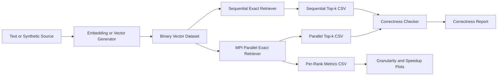

# Project Scope

## Project Name

MPI-Based Parallel Long-Term Memory Retriever for AI Agent

## One-Sentence Summary

Build a C++17 and OpenMPI module that performs exact top-k vector retrieval over a large long-term memory store, then measure correctness, load balance, and speedup against a sequential baseline.

## Fixed Decisions for Phase 0

| Topic | Decision | Rationale |
| --- | --- | --- |
| Primary platform | WSL2 Linux | Cleaner MPI workflow than native Windows |
| MPI runtime | OpenMPI | Standard Linux MPI toolchain, easy package install |
| Language | C++17 | Good balance between modern features and toolchain support |
| Build system | CMake + Ninja | Simple, portable, and IDE-friendly |
| Core scope | Exact top-k retrieval only | Keeps the project centered on parallel computing |
| Parallelism | Data parallelism over memory vectors | Best fit for dense exact retrieval |
| Decomposition | 1D contiguous block decomposition | Lowest communication complexity for v1 |
| Similarity | Dot product on normalized float32 vectors | Equivalent to cosine after normalization |
| Default dimension | D = 384 | Lower memory cost than 768 while still realistic |
| Default top-k | k = 10 | Standard retrieval setting |
| Default query counts | Q = 100 smoke, Q = 500 standard, Q = 1000 stress | Covers correctness, runtime tuning, and heavier runs |
| Primary benchmark source | Synthetic normalized vectors | Best for controlled speedup and correctness studies |
| Real-text support | MS MARCO v1.1, UIT-ViQuAD2.0, SQuAD | Good mix of scale, clean structure, and demo value |
| Demo scope | Optional metadata-backed memory display | Enough to show AI-agent relevance without building a chatbot |

## Problem Statement

Given a query embedding `q` and a memory database `V` with `N` vectors of dimension `D`, return the top `k` memory items with the highest similarity scores.

## Phase 0 Goals

Phase 0 exists to remove ambiguity before code is written. By the end of this phase, the project must have:

1. A locked technical scope.
2. A locked algorithm choice for the first implementation.
3. A locked binary dataset contract.
4. A locked benchmark policy.
5. A locked runtime environment decision.

## Pipeline



## In Scope

1. Binary vector dataset generation and loading.
2. Sequential exact top-k retrieval.
3. MPI-based parallel exact top-k retrieval.
4. Timing breakdown for compute, communication, active, and idle time.
5. CSV outputs for correctness, runtime by `N`, granularity, and speedup.
6. A small memory-text demo that shows how retrieval can plug into an AI agent.

## Out of Scope

1. Full chatbot or full production RAG system.
2. ANN algorithms as the main retriever.
3. GPU implementation.
4. Complex UI or web product.
5. End-to-end document parsing pipeline as the project core.

## Inputs and Outputs

### Inputs

- `N`: number of memory vectors
- `D`: embedding dimension
- `Q`: number of query vectors
- `k`: number of neighbors to return
- `P`: number of MPI processes
- `vectors.bin`: memory vector dataset
- `queries.bin`: query vector dataset
- `metadata.tsv`: optional mapping from `memory_id` to source text

### Outputs

- `results/sequential_topk.csv`
- `results/parallel_topk.csv`
- `results/correctness.csv`
- `results/runtime_by_N.csv`
- `results/granularity.csv`
- `results/speedup.csv`

## Input and Output Contract

For each query vector, the retriever must return:

```text
[(memory_id_1, score_1), ..., (memory_id_k, score_k)]
```

Results must be sorted by:

1. Higher score first.
2. Lower `memory_id` first when scores are equal.

## Parallel Computing Requirement Mapping

| Requirement | Project Answer |
| --- | --- |
| Parallelism level | Data-level parallelism on memory vectors |
| Decomposition | 1D block decomposition across `N` |
| Mapping | One contiguous shard per MPI rank |
| Communication | Rank 0 broadcasts queries, workers return local top-k, rank 0 merges |
| Topology | Logical master-worker using collectives |
| Correctness | Compare exact parallel results to exact sequential baseline |
| Granularity | `local_N` per rank |
| Load balance | Measured from per-rank compute, communication, and idle time |
| Speedup | Measured using both compute-only and total runtime |

## Phase 0 Exit Criteria

Phase 0 is complete when all of the following are true:

1. `docs/project_scope.md` defines the project boundary and fixed decisions.
2. `docs/algorithm_design.md` defines the first algorithm and data contracts.
3. `docs/benchmark_data.md` explains which datasets are used and why.
4. `docs/environment_setup.md` defines the WSL2 and OpenMPI environment.
5. No remaining ambiguity exists around `D`, `k`, `Q`, binary format, or benchmark outputs.

## Related Documents

- `docs/algorithm_design.md`
- `docs/benchmark_data.md`
- `docs/environment_setup.md`
- `docs/development/parallel_agent_memory_retriever_plan.md`
