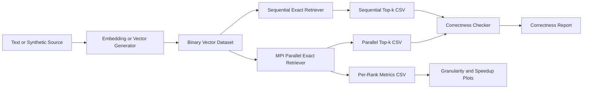

# Project Specification

This file merges the former `project_scope.md` and `algorithm_design.md` without shortening their content.

## Included Documents

- `project_scope.md`
- `algorithm_design.md`

---

# Project Scope

## Project Name

MPI-Based Parallel Long-Term Memory Retriever for AI Agent

## One-Sentence Summary

Build a C++17 and OpenMPI module that performs exact top-k vector retrieval over a large long-term memory store, then measure correctness, load balance, and speedup against a sequential baseline.

## Fixed Decisions for Phase 0

| Topic | Decision | Rationale |
| --- | --- | --- |
| Primary platform | WSL2 Linux | Cleaner MPI workflow than native Windows |
| MPI runtime | OpenMPI | Standard Linux MPI toolchain, easy package install |
| Language | C++17 | Good balance between modern features and toolchain support |
| Build system | CMake + Ninja | Simple, portable, and IDE-friendly |
| Core scope | Exact top-k retrieval only | Keeps the project centered on parallel computing |
| Parallelism | Data parallelism over memory vectors | Best fit for dense exact retrieval |
| Decomposition | 1D contiguous block decomposition | Lowest communication complexity for v1 |
| Similarity | Dot product on normalized float32 vectors | Equivalent to cosine after normalization |
| Default dimension | D = 384 | Lower memory cost than 768 while still realistic |
| Default top-k | k = 10 | Standard retrieval setting |
| Default query counts | Q = 100 smoke, Q = 500 standard, Q = 1000 stress | Covers correctness, runtime tuning, and heavier runs |
| Primary benchmark source | Synthetic normalized vectors | Best for controlled speedup and correctness studies |
| Real-text support | MS MARCO v1.1, UIT-ViQuAD2.0, SQuAD | Good mix of scale, clean structure, and demo value |
| Demo scope | Optional metadata-backed memory display | Enough to show AI-agent relevance without building a chatbot |

## Problem Statement

Given a query embedding `q` and a memory database `V` with `N` vectors of dimension `D`, return the top `k` memory items with the highest similarity scores.

## Phase 0 Goals

Phase 0 exists to remove ambiguity before code is written. By the end of this phase, the project must have:

1. A locked technical scope.
2. A locked algorithm choice for the first implementation.
3. A locked binary dataset contract.
4. A locked benchmark policy.
5. A locked runtime environment decision.

## Pipeline



## In Scope

1. Binary vector dataset generation and loading.
2. Sequential exact top-k retrieval.
3. MPI-based parallel exact top-k retrieval.
4. Timing breakdown for compute, communication, active, and idle time.
5. CSV outputs for correctness, runtime by `N`, granularity, and speedup.
6. A small memory-text demo that shows how retrieval can plug into an AI agent.

## Out of Scope

1. Full chatbot or full production RAG system.
2. ANN algorithms as the main retriever.
3. GPU implementation.
4. Complex UI or web product.
5. End-to-end document parsing pipeline as the project core.

## Inputs and Outputs

### Inputs

- `N`: number of memory vectors
- `D`: embedding dimension
- `Q`: number of query vectors
- `k`: number of neighbors to return
- `P`: number of MPI processes
- `vectors.bin`: memory vector dataset
- `queries.bin`: query vector dataset
- `metadata.tsv`: optional mapping from `memory_id` to source text

### Outputs

- `results/sequential_topk.csv`
- `results/parallel_topk.csv`
- `results/correctness.csv`
- `results/runtime_by_N.csv`
- `results/granularity.csv`
- `results/speedup.csv`

## Input and Output Contract

For each query vector, the retriever must return:

```text
[(memory_id_1, score_1), ..., (memory_id_k, score_k)]
```

Results must be sorted by:

1. Higher score first.
2. Lower `memory_id` first when scores are equal.

## Parallel Computing Requirement Mapping

| Requirement | Project Answer |
| --- | --- |
| Parallelism level | Data-level parallelism on memory vectors |
| Decomposition | 1D block decomposition across `N` |
| Mapping | One contiguous shard per MPI rank |
| Communication | Rank 0 broadcasts queries, workers return local top-k, rank 0 merges |
| Topology | Logical master-worker using collectives |
| Correctness | Compare exact parallel results to exact sequential baseline |
| Granularity | `local_N` per rank |
| Load balance | Measured from per-rank compute, communication, and idle time |
| Speedup | Measured using both compute-only and total runtime |

## Phase 0 Exit Criteria

Phase 0 is complete when all of the following are true:

1. `docs/development/project_specification.md` defines the project boundary and fixed decisions.
2. `docs/development/project_specification.md` defines the first algorithm and data contracts.
3. `docs/development/data_pipeline_and_benchmarks.md` explains which datasets are used and why.
4. `docs/development/developer_guide.md` defines the WSL2 and OpenMPI environment.
5. No remaining ambiguity exists around `D`, `k`, `Q`, binary format, or benchmark outputs.

## Related Documents

- `docs/development/project_specification.md`
- `docs/development/data_pipeline_and_benchmarks.md`
- `docs/development/developer_guide.md`
- `docs/development/parallel_agent_memory_retriever_plan.md`


---

# Algorithm Design

## Design Goal

Implement a deterministic, exact, MPI-based top-k retriever whose output can be compared directly against a sequential baseline.

## Version 1 Design Summary

Version 1 uses:

1. Sequential scan for the baseline.
2. Static 1D contiguous block decomposition for the parallel path.
3. Blocking collectives for clarity and reproducibility.
4. Rank 0 merge of local top-k candidate lists.

This is intentionally simple. It minimizes moving parts in the first implementation and makes correctness easier to prove.

## Data Model

### Memory Record

```text
memory_id: uint64
embedding: float32[D]
metadata_text: stored separately in metadata.tsv when needed
```

### Query Record

```text
query_id: uint64
embedding: float32[D]
```

## Binary Dataset Format

The project will use a slightly richer header than the original draft so the file is self-describing and easier to inspect.

### Header Layout

```text
magic[8]      = "PMRAGV1"
version       = uint32 = 1
flags         = uint32
num_vectors   = uint64
dimension     = uint32
reserved0     = uint32
```

### Flags

- bit 0: vectors are L2-normalized
- bit 1: data is row-major

### Data Layout

```text
float32 vectors[num_vectors][dimension]
```

### Contract

1. Little-endian layout.
2. Dense row-major storage.
3. No text metadata embedded in the binary file.
4. Optional `metadata.tsv` stores `memory_id<TAB>memory_text`.

## Similarity Function

All vectors should be normalized during dataset creation or preprocessing. With normalized vectors:

```text
score(q, v) = dot(q, v)
```

This keeps the runtime kernel simple and predictable.

## Sequential Baseline

### Purpose

1. Produce the ground-truth exact result.
2. Act as the speedup denominator.
3. Catch merge or communication bugs in the parallel path.

### Pseudocode

```text
for each query q:
    create min-heap H with capacity k
    for memory_id in [0, N):
        score = dot(q, V[memory_id])
        if H.size < k:
            push (memory_id, score)
        else if score > H.min_score:
            pop min
            push (memory_id, score)
        else if score == H.min_score and memory_id < H.min_memory_id:
            pop min
            push (memory_id, score)
    sort H by score descending, memory_id ascending
    emit result row(s)
```

## Parallel Retrieval Design

## Shard Assignment

For `N` vectors and `P` MPI ranks:

```text
base = N / P
rem  = N % P

local_N(rank) = base + 1, if rank < rem
local_N(rank) = base,     otherwise

start(rank) = rank * base + min(rank, rem)
end(rank)   = start(rank) + local_N(rank)
```

This guarantees balanced shards when `N` is not divisible by `P`.

## Communication Pattern

For each query:

1. Rank 0 loads or owns the query vector.
2. Rank 0 broadcasts the query vector to all ranks.
3. Each rank computes local top-k on its shard.
4. Each rank packs its local candidates into a flat array.
5. Rank 0 gathers all local candidate arrays.
6. Rank 0 merges `P * k` candidates into the global top-k.
7. Rank 0 writes the final results and metrics.

## Why Contiguous 1D Blocks

This is the best Phase 1-4 default because:

1. The full dot product stays local to each rank.
2. There is no partial-score reduction across ranks.
3. The communication volume is small: only query vectors and local top-k candidates move.
4. The load is naturally balanced for dense fixed-width vectors.

Block-cyclic and dynamic scheduling remain fallback options if measurements later show imbalance.

## Global Merge Contract

Each candidate is ordered by:

1. Higher score first.
2. Lower `memory_id` first on ties.

This same rule must be used in:

1. Local heap maintenance.
2. Local result sorting.
3. Rank 0 global merge.
4. Correctness checker.

## Determinism and Correctness

The project uses exact search, so correctness means:

1. Parallel and sequential top-k IDs match for every query.
2. Score differences remain within `epsilon`.

Recommended epsilon:

```text
1e-5
```

## Metrics to Record

Per run:

- `compute_time`
- `communication_time`
- `total_time`

Per rank:

- `rank`
- `local_N`
- `compute_time`
- `communication_time`
- `active_time`
- `global_total_time`
- `idle_time`

Definitions:

```text
active_time = compute_time + communication_time
idle_time   = global_total_time - active_time
```

## CSV Contracts

### Top-k Output

Suggested schema:

```csv
query_id,rank_position,memory_id,score
0,1,12345,0.892341
```

### Correctness Output

```csv
query_id,k,matched,matched_ids,max_score_diff,status
0,10,true,10,0.000001,PASS
```

### Runtime by N

```csv
N,D,Q,k,P,compute_time,total_communication_time,total_time
100000,384,100,10,8,12.4,0.8,13.2
```

### Granularity

```csv
rank,local_N,compute_time,communication_time,active_time,global_total_time,idle_time
0,125000,35.2,1.8,37.0,37.5,0.5
```

### Speedup

```csv
N,D,Q,k,P,compute_time,communication_time,total_time,compute_speedup,total_speedup,compute_efficiency,total_efficiency
2000000,384,100,10,8,40.0,1.9,41.9,7.10,6.87,0.89,0.86
```

## Initial Benchmark Modes

1. `synthetic-runtime`: generated normalized float32 vectors for speedup and granularity.
2. `realtext-demo`: text-backed vectors plus metadata for qualitative inspection.
3. `correctness`: sequential versus parallel on the same binary vector input.

## Deferred Design Choices

These are intentionally not part of Version 1:

1. Non-blocking collectives.
2. Query-batch parallelism as a first-class mode.
3. ANN indexes.
4. Embedded metadata in the binary file.
5. Two-dimensional decomposition.

