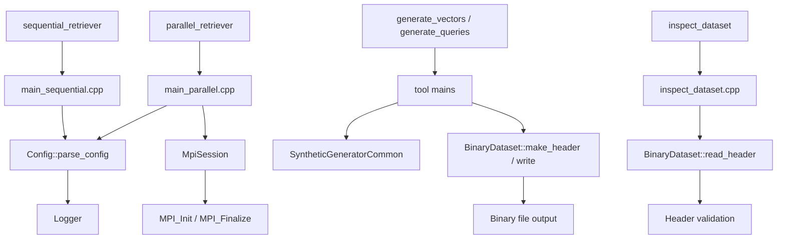
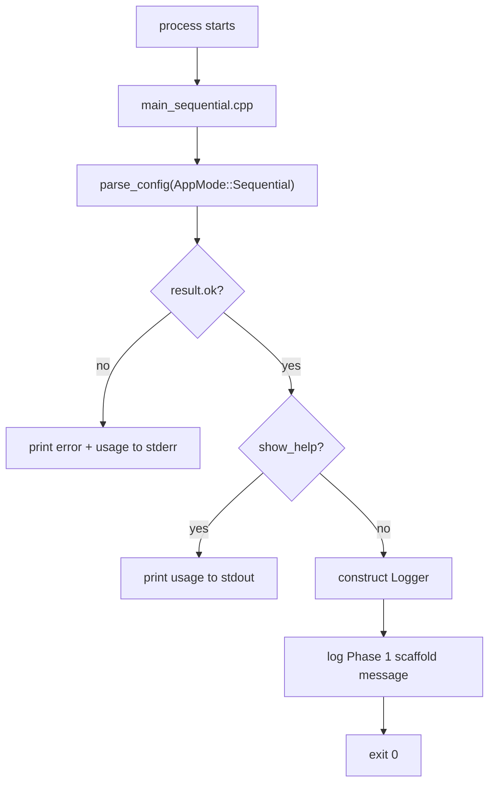
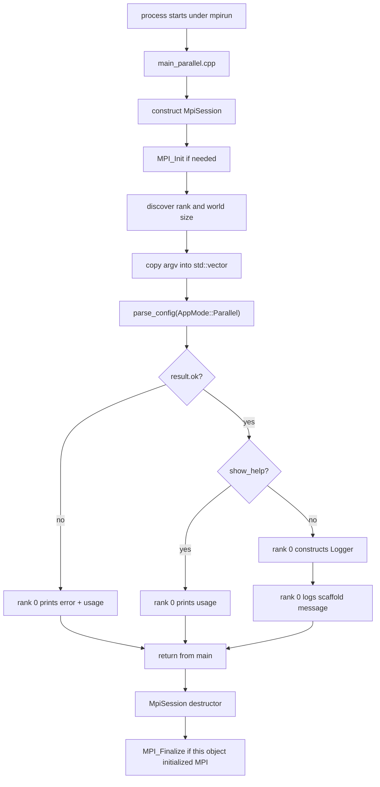
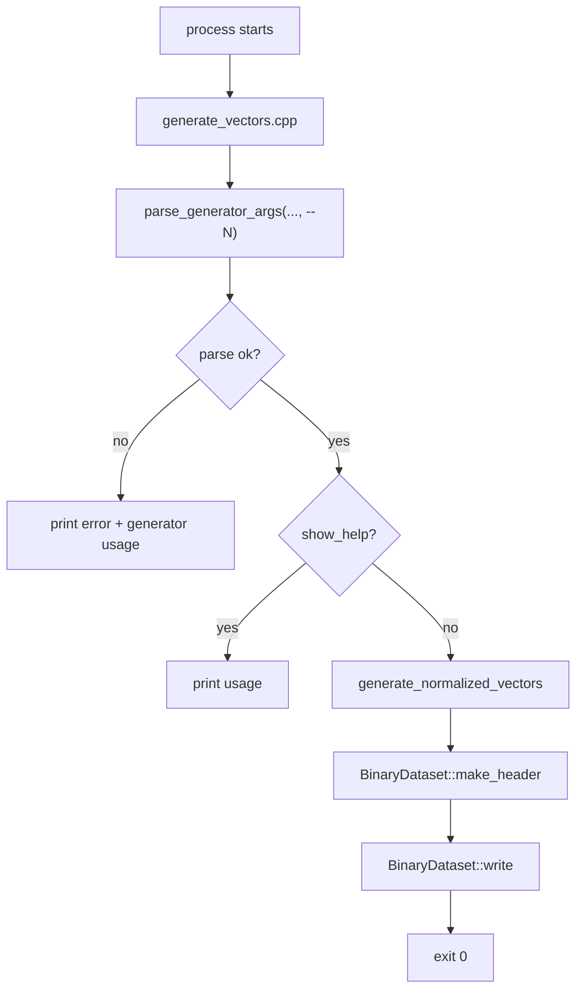

# Source Guide

This file merges the former `source_code_walkthrough.md` and `source_file_reference.md` without shortening their content.

## Included Documents

- `source_code_walkthrough.md`
- `source_file_reference.md`

---

# Source Code Walkthrough

## Purpose

This document explains how the current Phase 1 and Phase 2 code actually runs at source level.

It is written for two use cases:

- understanding the runtime pipeline for a report or presentation
- onboarding the next engineer before Phase 3 retrieval logic is added

The codebase currently provides:

- retriever CLI scaffolding
- MPI process bootstrap
- deterministic synthetic dataset generation
- binary dataset reading and shard-aware loading
- smoke and validation tests

It does **not** provide exact retrieval yet. The retriever binaries still stop after argument validation and logging.

## Reading Order

If you want the fastest path to understanding, read the source in this order:

1. `CMakeLists.txt`
2. `src/main_sequential.cpp`
3. `src/main_parallel.cpp`
4. `src/Config.cpp` and `include/Config.hpp`
5. `src/Logger.cpp` and `include/Logger.hpp`
6. `src/MpiSession.cpp` and `include/MpiSession.hpp`
7. `tools/generate_vectors.cpp`
8. `tools/generate_queries.cpp`
9. `tools/SyntheticGeneratorCommon.hpp`
10. `include/BinaryDataset.hpp` and `src/BinaryDataset.cpp`
11. `tools/inspect_dataset.cpp`
12. `tests/ConfigLoggerTest.cpp`
13. `tests/BinaryDatasetTest.cpp`

For a file-by-file reference, also read [source_file_reference.md](#source-file-reference).

## Build Targets and Ownership

`CMakeLists.txt` defines the current executable layout:

- `retriever_core`
  - shared internal library
  - contains `BinaryDataset.cpp`, `Config.cpp`, and `Logger.cpp`
- `sequential_retriever`
  - sequential CLI entrypoint
  - links only against `retriever_core`
- `parallel_retriever`
  - MPI CLI entrypoint
  - links against `retriever_core` and `MPI::MPI_CXX`
- `generate_vectors`
  - synthetic memory-vector generator
- `generate_queries`
  - synthetic query-vector generator
- `inspect_dataset`
  - read-only binary header inspector
- `config_logger_test`
  - parser and usage-contract checks
- `binary_dataset_test`
  - binary dataset validation and shard checks

The design intent is:

- shared reusable logic lives in `retriever_core`
- MPI lifecycle logic lives only in the parallel entrypoint
- generator-specific parsing and sampling stay in `tools/`
- tests exercise both library code and real executable behavior

## High-Level Architecture



## Runtime Pipeline by Executable

## 1. `sequential_retriever`

### Control Flow



### What happens in detail

1. `main_sequential.cpp` calls `retriever::parse_config(retriever::AppMode::Sequential, argc, argv)`.
2. `parse_config` validates the Phase 1 CLI contract:
   - `--vectors`
   - `--queries`
   - `--output`
   - `--topk`
   - optional `--log-level`
   - optional `--help`
3. If parsing fails:
   - the program prints `Error: ...`
   - it prints `usage_text(AppMode::Sequential)`
   - it exits with code `1`
4. If `--help` is present:
   - the program prints usage to `stdout`
   - it exits `0`
5. Otherwise:
   - it builds a `Logger` from `result.config.log_level`
   - it logs two info messages
   - it exits `0`

### Important Phase Boundary

The sequential binary does **not** read vectors, score queries, or write retrieval output yet. It only proves that the CLI contract and future entrypoint shape are stable.

## 2. `parallel_retriever`

### Control Flow



### What happens in detail

1. `main_parallel.cpp` constructs `retriever::MpiSession mpi_session(argc, argv)`.
2. The `MpiSession` constructor:
   - checks `MPI_Initialized`
   - calls `MPI_Init` only if MPI is not already initialized
   - remembers whether this object owns MPI shutdown
   - queries `MPI_Comm_rank` and `MPI_Comm_size`
3. The code then copies `argv` into `std::vector<const char*> args(argv, argv + argc)`.
   - this is a small adapter because `parse_config` expects `const char* const argv[]`
4. `parse_config(AppMode::Parallel, argc, args.data())` is called.
5. If parsing fails:
   - only rank `0` prints the error and usage
   - all ranks return `1`
6. If `--help` is requested:
   - only rank `0` prints help
   - all ranks return `0`
7. Otherwise:
   - only rank `0` constructs `Logger`
   - only rank `0` prints the scaffold messages
8. On scope exit, `MpiSession::~MpiSession()` calls `MPI_Finalize` only if this object performed `MPI_Init`.

### Why only rank 0 prints

Without the rank guard, every process would print the same help or error text. The current implementation deliberately centralizes human-facing output on rank `0` so the CLI remains readable.

### Important Phase Boundary

Like the sequential binary, the parallel binary still does **not** load datasets or perform retrieval. Its current purpose is safe MPI startup, stable argument parsing, and correct help/error behavior under `mpirun`.

## 3. `generate_vectors`

### Control Flow



### What happens in detail

1. `generate_vectors.cpp` defines two constants:
   - `kBinaryName = "generate_vectors"`
   - `kCountFlag = "--N"`
2. It calls `parse_generator_args(argc, argv, "--N")`.
3. If parsing fails, it prints the error plus usage and exits `1`.
4. If `--help` is present, it prints usage and exits `0`.
5. Otherwise it calls `generate_normalized_vectors(count, dimension, seed)`.
6. The returned vector buffer is paired with a binary header created by:
   - `BinaryDataset::make_header`
   - flags = `kFlagNormalized | kFlagRowMajor`
7. `BinaryDataset::write` serializes header + payload to disk.

### Output Contract

The output file is a normalized, row-major `float32` binary dataset with the `PMRAGV1` header contract.

## 4. `generate_queries`

This binary has the same structure as `generate_vectors`, but it changes the required count flag:

- `generate_vectors` uses `--N`
- `generate_queries` uses `--Q`

Everything else is intentionally identical:

- same parser helper
- same deterministic generator
- same normalization rule
- same binary writer

The symmetry is useful for future phases because both vectors and queries share the same on-disk format.

## 5. `inspect_dataset`

### Control Flow

1. `inspect_dataset.cpp` parses:
   - `--input <path>`
   - optional `--help`
2. Unknown flags or missing `--input` values cause an immediate error + usage.
3. On a valid execution path, the program calls `BinaryDataset::read_header(input_path)`.
4. The returned header is printed field by field:
   - `magic`
   - `version`
   - `flags`
   - `num_vectors`
   - `dimension`
   - `reserved0`

### Design Choice

`inspect_dataset` reads only the header, not the full payload. That keeps it fast and safe even for large files, while still exposing the metadata needed for debugging and smoke validation.

## Shared Components

## `Config`

`Config` is the CLI contract for the retriever binaries only.

### Data carried by `Config`

- `show_help`
- `vectors_path`
- `queries_path`
- `output_path`
- `metrics_path`
- `topk`
- `log_level`

### `parse_config` behavior

`src/Config.cpp` performs three jobs:

1. parse flags in order from `argv`
2. convert typed values such as `--topk`
3. enforce required-flag rules after parsing

Key helper functions:

- `binary_name(mode)`
  - selects `sequential_retriever` or `parallel_retriever`
  - used for error messages
- `join_missing_flags`
  - formats the final missing-option list
- `parse_positive_int`
  - validates `--topk`
- `failure`
  - builds a `ParseResult` with `ok = false`

### Phase-specific behavior

- sequential mode rejects `--metrics`
- parallel mode requires `--metrics`
- `--help` short-circuits missing-option validation

That last rule is why `sequential_retriever --help` works without needing `--vectors`, `--queries`, `--output`, and `--topk`.

## `Logger`

`Logger` is intentionally tiny.

### What it does

- parses the textual log level
- stores a minimum log threshold
- writes matching log lines to `stderr`

### How filtering works

`should_log` compares enum values by integer order:

- `Debug`
- `Info`
- `Warn`
- `Error`

If the message level is below the configured threshold, `log` returns immediately.

### Formatting

`to_string` converts enum values into uppercase tags such as:

- `DEBUG`
- `INFO`
- `WARN`
- `ERROR`

Each printed line uses:

```text
[LEVEL] message
```

## `MpiSession`

`MpiSession` is a resource-management wrapper around MPI lifecycle calls.

### Why it exists

Without this wrapper, every MPI entrypoint would need to manually handle:

- `MPI_Init`
- rank lookup
- world-size lookup
- `MPI_Finalize`
- repeated-init safety

`MpiSession` centralizes that logic and makes the parallel `main` easy to read.

### Ownership model

`owns_mpi_` is the crucial field.

- if the constructor had to call `MPI_Init`, `owns_mpi_ = true`
- if MPI was already initialized, `owns_mpi_ = false`

The destructor only finalizes MPI when `owns_mpi_` is true and `MPI_Finalized` says shutdown has not happened yet.

This prevents accidental double finalization.

## `BinaryDataset`

`BinaryDataset` is the most important reusable Phase 2 component.

### Public responsibilities

- define the binary header shape
- write validated datasets
- read and validate headers
- read full payloads
- read contiguous shards
- compute shard bounds

### Internal helper responsibilities

Inside `src/BinaryDataset.cpp`, the anonymous namespace contains the defensive utilities that make the public API safe:

- `kExpectedMagic`
  - the literal `PMRAGV1\0` signature
- `kHeaderSize`
  - byte size of the fixed header
- `ensure_little_endian`
  - rejects unsupported host byte order
- `checked_multiply`
  - overflow-safe size computation
- `checked_add`
  - overflow-safe file-size computation
- `expected_value_count`
  - `num_vectors * dimension`
- `expected_payload_bytes`
  - payload bytes for `float32`
- `validate_header_fields`
  - checks magic, version, and positive dimension
- `open_input` and `open_output`
  - file opening with explicit error messages
- `file_size_bytes`
  - gets file size for consistency checks
- `read_value` and `write_value`
  - tiny typed IO helpers
- `read_validated_header`
  - the core validation routine shared by all readers
- `validate_write_request`
  - checks header + payload compatibility before serialization

### Why `read_header` still checks payload size

Even though `read_header` returns only the header, it still calls `read_validated_header`, which verifies that the file size matches the metadata. This means the header inspector rejects corrupted or truncated files instead of reporting misleading metadata.

### Shard logic

`compute_shard_bounds(total_vectors, rank, world_size)` implements contiguous block decomposition:

```text
base = total_vectors / world_size
remainder = total_vectors % world_size
count = base + 1 for ranks < remainder, else base
start = rank * base + min(rank, remainder)
```

`read_shard` then:

1. validates the file
2. computes the local start/count
3. seeks directly to the shard's first `float`
4. reads one contiguous slice into memory

This is important for Phase 3 because MPI retrieval code can call the dataset layer directly instead of re-implementing sharding math.

## `SyntheticGeneratorCommon`

This header is intentionally tool-local, not part of `retriever_core`.

### Why it is not inside `include/`

The retriever binaries do not need synthetic generator parsing or random sampling. Keeping these helpers in `tools/` prevents the public shared interface from growing faster than necessary.

### What it provides

- `SyntheticGeneratorOptions`
- `SyntheticGeneratorParseResult`
- `generator_usage_text`
- `try_parse_uint64`
- `try_parse_positive_dimension`
- `parse_generator_args`
- `uniform_unit_interval`
- `generate_normalized_vectors`

### Deterministic sampling path

`generate_normalized_vectors` uses:

1. `std::mt19937_64` seeded from `--seed`
2. `uniform_unit_interval` to obtain deterministic uniform samples
3. Box-Muller transform to convert uniforms into normal samples
4. row-wise L2 normalization
5. fallback to `[1, 0, 0, ...]` if a zero norm ever appears

This design avoids depending on implementation-specific behavior of `std::normal_distribution`.

## How Data Moves Through the Dataset Pipeline

The dataset tools form a complete Phase 2 pipeline:

1. `generate_vectors` or `generate_queries`
2. parse CLI into `SyntheticGeneratorOptions`
3. generate normalized `std::vector<float>`
4. create `BinaryDatasetHeader`
5. serialize with `BinaryDataset::write`
6. verify later with `inspect_dataset` or `BinaryDataset::read_*`

At the end of Phase 2, the retriever binaries still do not consume these files, but the format and loader are now fixed for Phase 3.

## Tests as Executable Documentation

The current tests are also part of the documentation story because they show intended behavior precisely.

### `ConfigLoggerTest.cpp`

This test file documents the retriever CLI contract by checking:

- help parsing
- missing required options
- invalid `--topk`
- invalid `--log-level`
- parallel-only `--metrics`
- usage text contents

### `BinaryDatasetTest.cpp`

This test file documents the binary contract by checking:

- valid header round-trip
- invalid magic rejection
- invalid version rejection
- zero-dimension rejection
- truncated payload rejection
- divisible shard math
- non-divisible shard math
- correctness of `read_shard`

### CMake-driven smoke tests

The `tests/cmake/*.cmake` scripts validate behavior at the executable level:

- tool `--help` works
- generator output can be inspected successfully
- deterministic seeds produce byte-identical files
- different seeds change the binary output

## Source Boundaries to Remember Before Phase 3

When implementing retrieval next, keep these current boundaries in mind:

- `parse_config` is only for retriever binaries
- synthetic generator parsing stays in `tools/`
- `BinaryDataset` already owns file-format and shard decisions
- `MpiSession` already owns MPI lifecycle
- rank `0` is the only process that should print human-facing CLI text in the parallel binary

These boundaries are what keep the current codebase understandable.

## Suggested Report Framing

If you need to explain the current source code in a report, this wording fits the implementation well:

1. Phase 1 established the execution scaffold:
   - stable CLI contracts
   - logging
   - MPI bootstrap
2. Phase 2 established the dataset substrate:
   - deterministic synthetic data generation
   - fixed binary file contract
   - shard-aware loading
3. Phase 3 can focus on retrieval logic without reopening environment, CLI, file-format, or sharding decisions.


---

# Source File Reference

## Purpose

This document explains the role of every current source and test file that matters to the Phase 1 and Phase 2 implementation.

Use [source_code_walkthrough.md](#source-code-walkthrough) for end-to-end flow.
Use this file when you want to answer: "What exactly is this file responsible for?"

## Shared Headers in `include/`

## `include/Config.hpp`

**Responsibility**

- declares the retriever CLI contract
- defines the parse result returned by `parse_config`

**Key symbols**

- `enum class AppMode`
- `struct Config`
- `struct ParseResult`
- `parse_config(...)`
- `usage_text(...)`

**Used by**

- `src/main_sequential.cpp`
- `src/main_parallel.cpp`
- `tests/ConfigLoggerTest.cpp`

**Important note**

This header is intentionally limited to retriever binaries. Generator tools do not use it.

## `include/Logger.hpp`

**Responsibility**

- declares log levels
- exposes a minimal stderr logger

**Key symbols**

- `enum class LogLevel`
- `try_parse_log_level(...)`
- `to_string(...)`
- `class Logger`

**Used by**

- `src/Config.cpp`
- `src/main_sequential.cpp`
- `src/main_parallel.cpp`

## `include/MpiSession.hpp`

**Responsibility**

- declares the RAII wrapper for MPI lifecycle management

**Key symbols**

- `class MpiSession`
- constructor
- destructor
- `rank()`
- `size()`

**Used by**

- `src/main_parallel.cpp`

**Important note**

This file is not part of `retriever_core` because MPI is required only by the parallel binary.

## `include/BinaryDataset.hpp`

**Responsibility**

- declares the Phase 2 binary dataset contract and loader/writer API

**Key symbols**

- `struct BinaryDatasetHeader`
- `struct BinaryDatasetContents`
- `struct ShardBounds`
- `struct BinaryDatasetShard`
- `class BinaryDataset`

**Used by**

- `src/BinaryDataset.cpp`
- `tools/generate_vectors.cpp`
- `tools/generate_queries.cpp`
- `tools/inspect_dataset.cpp`
- `tests/BinaryDatasetTest.cpp`

**Important note**

This is the shared boundary that Phase 3 retrieval logic should reuse instead of inventing a second dataset API.

## Shared Implementations in `src/`

## `src/Config.cpp`

**Responsibility**

- implements retriever CLI parsing and usage text

**What it does**

- maps `AppMode` to a binary name
- parses flag values from `argv`
- validates `--topk`
- validates `--log-level`
- rejects unknown flags
- enforces required flags after parsing
- formats user-facing help text

**Internal helper functions**

- `binary_name`
- `join_missing_flags`
- `parse_positive_int`
- `failure`

**Important note**

This file intentionally stops at argument validation. It does not touch filesystem or retrieval logic.

## `src/Logger.cpp`

**Responsibility**

- implements logging and log-level parsing

**What it does**

- lowercases the log-level string
- converts accepted values into `LogLevel`
- filters messages below the configured threshold
- prints `[LEVEL] message` to `stderr`

**Internal helper functions**

- `to_lower_copy`

**Important note**

The logger is intentionally minimal so Phase 1 and Phase 2 scaffolding remains easy to audit.

## `src/MpiSession.cpp`

**Responsibility**

- implements safe MPI startup and teardown

**What it does**

- checks whether MPI is already initialized
- initializes MPI if needed
- records whether this object owns shutdown
- reads rank and world size
- finalizes MPI only when appropriate

**Important note**

This file is the reason `parallel_retriever --help` works cleanly under `mpirun`.

## `src/main_sequential.cpp`

**Responsibility**

- provides the sequential CLI entrypoint

**What it does**

- calls `parse_config` in sequential mode
- prints error + usage on failure
- prints usage on `--help`
- constructs `Logger`
- emits placeholder Phase 1 messages

**Important note**

This file is currently a scaffold only. Retrieval code will be added here in a later phase.

## `src/main_parallel.cpp`

**Responsibility**

- provides the MPI-aware parallel CLI entrypoint

**What it does**

- constructs `MpiSession`
- adapts `argv` into a format accepted by `parse_config`
- parses the parallel CLI contract
- restricts help/error output to rank `0`
- logs the placeholder scaffold message from rank `0`

**Important note**

This file already establishes a future-friendly pattern for parallel control flow:

- bootstrap MPI first
- parse once on every rank
- centralize user-facing output on rank `0`

## `src/BinaryDataset.cpp`

**Responsibility**

- implements the entire Phase 2 binary dataset layer

**What it does**

- validates host byte order
- validates header fields and total file size
- serializes header + payload
- reads header only
- reads the full payload
- reads a rank-local shard
- computes contiguous shard bounds

**Important note**

This file is the core substrate for Phase 3 data loading.

## Tool-Specific Files in `tools/`

## `tools/SyntheticGeneratorCommon.hpp`

**Responsibility**

- hosts shared helper code for synthetic dataset tools only

**What it does**

- defines generator CLI options
- parses `--N` or `--Q`, `--D`, `--output`, and `--seed`
- formats generator help text
- generates deterministic normal samples
- normalizes every vector

**Why it is a header**

Everything is `inline`, so both generator binaries can reuse the exact same implementation without adding another build target.

## `tools/generate_vectors.cpp`

**Responsibility**

- executable entrypoint for memory-vector dataset generation

**What it does**

- parses generator arguments using `--N`
- calls the deterministic generator
- creates a normalized row-major binary header
- writes the output file

**Output meaning**

The resulting file is intended to become the future memory-vector input for retriever runs.

## `tools/generate_queries.cpp`

**Responsibility**

- executable entrypoint for query-vector dataset generation

**What it does**

- mirrors `generate_vectors.cpp`
- changes only the required count flag from `--N` to `--Q`

**Output meaning**

The resulting file is intended to become the future query input for retriever runs.

## `tools/inspect_dataset.cpp`

**Responsibility**

- executable entrypoint for read-only dataset header inspection

**What it does**

- parses `--input`
- validates the binary file through `BinaryDataset::read_header`
- prints the header fields in a human-readable format

**Important note**

This is both a developer utility and a test helper because CTest smoke checks can assert exact header output.

## Test Files in `tests/`

## `tests/ConfigLoggerTest.cpp`

**Responsibility**

- verifies retriever CLI parsing and usage rules without MPI

**What it does**

- calls `parse_config` directly with small synthetic `argv` arrays
- asserts help behavior
- asserts missing-option behavior
- asserts invalid-value behavior
- asserts parallel-only `--metrics`
- asserts usage text contains the right flags

**Why it matters**

This test acts as an executable specification for the retriever command-line contract.

## `tests/BinaryDatasetTest.cpp`

**Responsibility**

- verifies the binary dataset layer directly

**What it does**

- writes small test files
- injects deliberately invalid headers
- checks round-trip behavior
- checks shard decomposition rules
- checks `read_shard` returns the expected slice

**Why it matters**

This test is the strongest proof that the on-disk contract is already fixed before Phase 3 begins.

## `tests/cmake/GenerateAndInspectDataset.cmake`

**Responsibility**

- provides an executable-level smoke test script for generators + inspector

**What it does**

- runs one generator tool
- checks the output file was created
- runs `inspect_dataset`
- asserts the printed header fields contain the expected values

**Why it matters**

This tests real binaries, not just library calls.

## `tests/cmake/CheckGeneratorDeterminism.cmake`

**Responsibility**

- checks deterministic output across seeds

**What it does**

- generates three files
- uses the same arguments for two of them
- uses a different seed for the third
- compares SHA-256 hashes

**Expected behavior**

- same seed => same hash
- different seed => different hash

## Build File

## `CMakeLists.txt`

**Responsibility**

- defines the build graph for the current project

**What it does**

- requires CMake `3.20`
- selects C++17
- enables `CTest`
- finds MPI
- builds `retriever_core`
- builds all executable targets
- registers CTest cases

**Why it matters**

This file is the authoritative map of which source files form which binary.

## Quick Mapping by Concern

If you need to explain the code by concern instead of by file, this is the shortest map:

- CLI parsing for retrievers:
  - `include/Config.hpp`
  - `src/Config.cpp`
- Logging:
  - `include/Logger.hpp`
  - `src/Logger.cpp`
- MPI bootstrap:
  - `include/MpiSession.hpp`
  - `src/MpiSession.cpp`
  - `src/main_parallel.cpp`
- Dataset format and IO:
  - `include/BinaryDataset.hpp`
  - `src/BinaryDataset.cpp`
- Synthetic dataset generation:
  - `tools/SyntheticGeneratorCommon.hpp`
  - `tools/generate_vectors.cpp`
  - `tools/generate_queries.cpp`
- Dataset inspection:
  - `tools/inspect_dataset.cpp`
- Executable behavior checks:
  - `tests/ConfigLoggerTest.cpp`
  - `tests/BinaryDatasetTest.cpp`
  - `tests/cmake/*.cmake`

## Suggested Maintenance Rule

When Phase 3 starts, update both of these documentation files whenever one of these happens:

- a new executable is added
- a header gains a new public type or function
- a file changes responsibility
- the runtime pipeline changes

