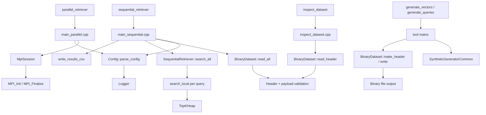
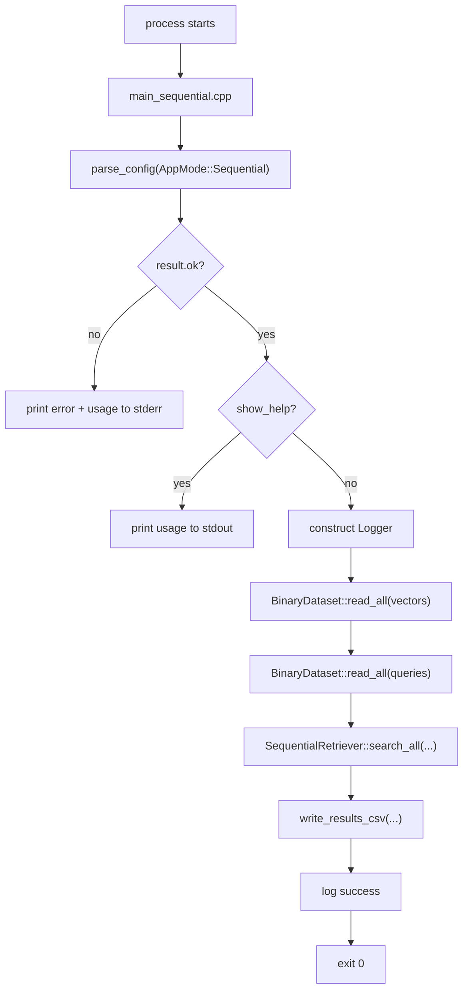
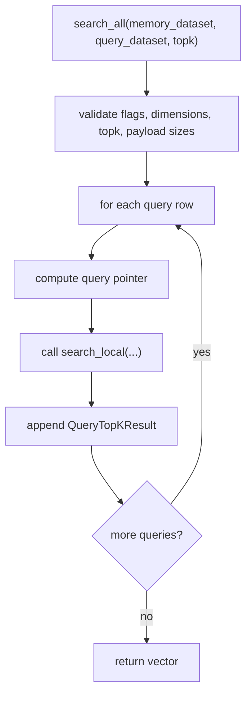
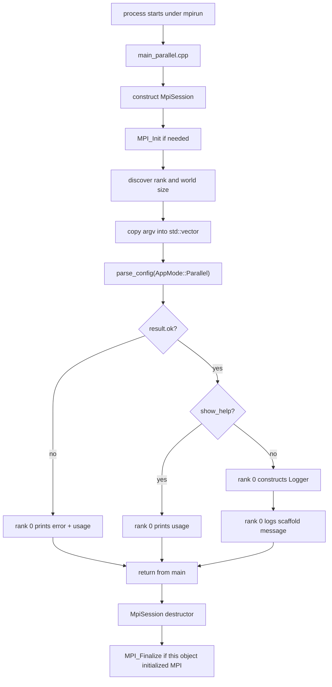
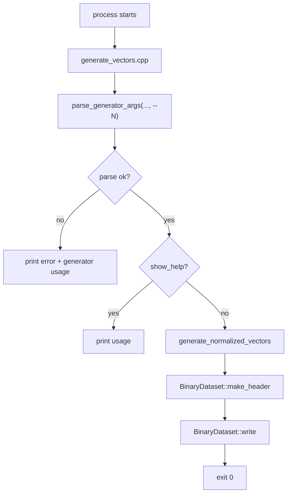

# Source Guide

This file merges the former `source_code_walkthrough.md` and `source_file_reference.md` without shortening their content.

## Included Documents

- `source_code_walkthrough.md`
- `source_file_reference.md`

---

# Source Code Walkthrough

## Purpose

This document explains how the current Phase 1, Phase 2, and Phase 3 code actually runs at source level.

It is written for two use cases:

- understanding the runtime pipeline for a report or presentation
- onboarding the next engineer before Phase 4 parallel retrieval logic is added

The codebase currently provides:

- retriever CLI parsing and validation
- MPI process bootstrap for the parallel binary
- deterministic synthetic dataset generation
- binary dataset reading and shard-aware loading
- exact sequential top-k retrieval over normalized vectors
- canonical CSV output for sequential runs
- smoke and validation tests

The only major retrieval work still deferred is the MPI search path and later benchmark orchestration.

## Reading Order

If you want the fastest path to understanding, read the source in this order:

1. `CMakeLists.txt`
2. `src/main_sequential.cpp`
3. `include/SequentialRetriever.hpp`
4. `src/SequentialRetriever.cpp`
5. `include/TopKHeap.hpp`
6. `src/TopKHeap.cpp`
7. `include/BinaryDataset.hpp`
8. `src/BinaryDataset.cpp`
9. `src/main_parallel.cpp`
10. `src/MpiSession.cpp` and `include/MpiSession.hpp`
11. `src/Config.cpp` and `include/Config.hpp`
12. `src/Logger.cpp` and `include/Logger.hpp`
13. `tools/generate_vectors.cpp`
14. `tools/generate_queries.cpp`
15. `tools/SyntheticGeneratorCommon.hpp`
16. `tools/inspect_dataset.cpp`
17. `tests/SequentialRetrieverTest.cpp`
18. `tests/BinaryDatasetTest.cpp`
19. `tests/ConfigLoggerTest.cpp`
20. `tests/cmake/*.cmake`

For a file-by-file reference, also read [source_file_reference.md](#source-file-reference).

## Build Targets and Ownership

`CMakeLists.txt` defines the current executable layout:

- `retriever_core`
  - shared internal library
  - contains `BinaryDataset.cpp`, `Config.cpp`, `Logger.cpp`, `TopKHeap.cpp`, and `SequentialRetriever.cpp`
- `sequential_retriever`
  - exact sequential CLI entrypoint
  - links against `retriever_core`
- `parallel_retriever`
  - MPI CLI entrypoint
  - links against `retriever_core` and `MPI::MPI_CXX`
- `generate_vectors`
  - synthetic memory-vector generator
- `generate_queries`
  - synthetic query-vector generator
- `inspect_dataset`
  - read-only binary header inspector
- `config_logger_test`
  - parser and usage-contract checks
- `binary_dataset_test`
  - binary dataset validation and shard checks
- `sequential_retriever_test`
  - heap ordering and exact retrieval correctness checks

The design intent is:

- shared reusable logic lives in `retriever_core`
- MPI lifecycle logic lives only in the parallel entrypoint
- generator-specific parsing and sampling stay in `tools/`
- sequential file I/O and CSV writing stay in `main_sequential.cpp`
- retrieval math and top-k maintenance are reusable in-memory core code for later Phase 4 local-shard reuse

## High-Level Architecture



## Runtime Pipeline by Executable

## 1. `sequential_retriever`

### Control Flow



### What happens in detail

1. `main_sequential.cpp` calls `retriever::parse_config(retriever::AppMode::Sequential, argc, argv)`.
2. `parse_config` validates the retriever CLI contract:
   - `--vectors`
   - `--queries`
   - `--output`
   - `--topk`
   - optional `--log-level`
   - optional `--help`
3. If parsing fails:
   - the program prints `Error: ...`
   - it prints `usage_text(AppMode::Sequential)`
   - it exits with code `1`
4. If `--help` is present:
   - the program prints usage to `stdout`
   - it exits `0`
5. Otherwise:
   - it constructs a `Logger`
   - it loads the memory dataset with `BinaryDataset::read_all(result.config.vectors_path)`
   - it loads the query dataset with `BinaryDataset::read_all(result.config.queries_path)`
   - it calls `SequentialRetriever::search_all(memory_dataset, query_dataset, topk)`
   - it writes the canonical CSV file
   - it logs completion and exits `0`
6. Any runtime exception is caught at `main` boundary and printed as `Error: ...` before the process exits `1`

### CSV Output Contract

`main_sequential.cpp` owns CSV serialization. It writes:

```text
query_id,rank_position,memory_id,score
```

Rules:

- one row per retrieved candidate
- `query_id` is the zero-based query row index
- `memory_id` is the zero-based memory row index
- `rank_position` is one-based within that query's top-k list
- `score` uses `std::fixed` and `std::setprecision(8)`

### Why file I/O stays in `main_sequential.cpp`

The retrieval core is intentionally file-agnostic. This keeps later reuse simple:

- Phase 3 sequential mode can load entire datasets and call the core
- Phase 4 parallel mode can load only a local shard and call the same local-scan method
- CSV formatting remains a CLI concern, not a math-library concern

## 2. `SequentialRetriever`

`SequentialRetriever` is the main new Phase 3 core component.

### Public surface

It exposes two static methods:

- `search_local(...)`
  - scores one query vector against a flat contiguous memory buffer
  - accepts `memory_id_offset` so Phase 4 can reuse it for local shard IDs
- `search_all(...)`
  - runs the full sequential execution across every query row in a fully loaded dataset

### `search_all(...)` flow



### Validation rules

`SequentialRetriever` throws `std::runtime_error` when:

- memory and query dimensions do not match
- either dataset is missing the normalized flag
- either dataset is missing the row-major flag
- `topk < 1`
- `topk > num_vectors` for full sequential search
- dataset payload size does not match header metadata

Those checks are deliberate because the algorithm assumes:

- row-major contiguous memory
- dot product is valid because vectors are already normalized
- IDs come from stable row positions

## 3. `TopKHeap`

`TopKHeap` is the second major Phase 3 component.

### Purpose

It keeps only the best `k` retrieval candidates seen so far during a linear scan.

### Ordering contract

The ordering logic is deterministic and matches the project specification:

- better candidate = higher score
- if scores tie, lower `memory_id` is better
- worse candidate = lower score
- if scores tie, higher `memory_id` is worse

### Internal structure

`TopKHeap` is implemented as a small manual binary heap over `std::vector<RetrievalCandidate>`.

- the root element is always the worst currently kept candidate
- a new candidate replaces the root only if it is strictly better
- `sorted_results()` copies and sorts the retained candidates into final best-first order

This design makes scan-time complexity:

- `O(log k)` per retained update
- `O(N log k)` for one query against `N` memory vectors

### Why not return partial unsorted heap content

The heap order is only useful internally. Final CSV output and tests need deterministic rank order, so `sorted_results()` returns:

1. highest score first
2. lower `memory_id` first on score ties

## 4. Exact scoring path inside `search_local(...)`

`search_local(...)` is the function Phase 4 is expected to reuse most directly.

For one query row it does the following:

1. validate flags, dimensions, `topk`, and buffer pointers
2. create `TopKHeap topk_heap(topk)`
3. loop over each local memory row
4. compute the dot product of:
   - `memory_values + local_index * dimension`
   - `query_values`
5. push `{memory_id_offset + local_index, score}` into the heap
6. return `QueryTopKResult { query_id, sorted_results }`

Because Phase 2 generators normalize all vectors, the dot product is already cosine similarity under the current assumptions.

## 5. `parallel_retriever`

### Control Flow



### What happens in detail

1. `main_parallel.cpp` constructs `retriever::MpiSession mpi_session(argc, argv)`.
2. The `MpiSession` constructor:
   - checks `MPI_Initialized`
   - calls `MPI_Init` only if MPI is not already initialized
   - remembers whether this object owns MPI shutdown
   - queries `MPI_Comm_rank` and `MPI_Comm_size`
3. The code copies `argv` into `std::vector<const char*> args(argv, argv + argc)` because `parse_config` expects `const char* const argv[]`.
4. `parse_config(AppMode::Parallel, argc, args.data())` is called.
5. If parsing fails:
   - only rank `0` prints the error and usage
   - all ranks return `1`
6. If `--help` is requested:
   - only rank `0` prints help
   - all ranks return `0`
7. Otherwise:
   - only rank `0` constructs `Logger`
   - only rank `0` prints the scaffold messages
8. On scope exit, `MpiSession::~MpiSession()` calls `MPI_Finalize` only if this object performed `MPI_Init`.

### Why only rank 0 prints

Without the rank guard, every process would print the same help or error text. The current implementation deliberately centralizes human-facing output on rank `0` so the CLI remains readable.

### Important Phase Boundary

Unlike the sequential binary, the parallel binary still does **not** load datasets or perform retrieval. Its current purpose is safe MPI startup, stable argument parsing, and correct help/error behavior under `mpirun`.

## 6. `generate_vectors`

### Control Flow



### What happens in detail

1. `generate_vectors.cpp` defines:
   - `kBinaryName = "generate_vectors"`
   - `kCountFlag = "--N"`
2. It calls `parse_generator_args(argc, argv, "--N")`.
3. If parsing fails, it prints the error plus usage and exits `1`.
4. If `--help` is present, it prints usage and exits `0`.
5. Otherwise it calls `generate_normalized_vectors(count, dimension, seed)`.
6. The returned vector buffer is paired with a binary header created by:
   - `BinaryDataset::make_header`
   - flags = `kFlagNormalized | kFlagRowMajor`
7. `BinaryDataset::write` serializes header + payload to disk.

## 7. `generate_queries`

This binary has the same structure as `generate_vectors`, but it changes the required count flag:

- `generate_vectors` uses `--N`
- `generate_queries` uses `--Q`

Everything else is intentionally identical:

- same parser helper
- same deterministic generator
- same normalization rule
- same binary writer

## 8. `inspect_dataset`

### Control Flow

1. `inspect_dataset.cpp` parses:
   - `--input <path>`
   - optional `--help`
2. Unknown flags or missing `--input` values cause an immediate error + usage.
3. On a valid execution path, the program calls `BinaryDataset::read_header(input_path)`.
4. The returned header is printed field by field:
   - `magic`
   - `version`
   - `flags`
   - `num_vectors`
   - `dimension`
   - `reserved0`

### Design Choice

`inspect_dataset` reads only the header, not the full payload. That keeps it fast and safe even for large files, while still exposing the metadata needed for debugging and smoke validation.

## Shared Components

## `Config`

`Config` is the CLI contract for the retriever binaries only.

### Data carried by `Config`

- `show_help`
- `vectors_path`
- `queries_path`
- `output_path`
- `metrics_path`
- `topk`
- `log_level`

### `parse_config` behavior

`src/Config.cpp` performs three jobs:

1. parse flags in order from `argv`
2. convert typed values such as `--topk`
3. enforce required-flag rules after parsing

Key helper functions:

- `binary_name(mode)`
  - selects `sequential_retriever` or `parallel_retriever`
  - used for error messages
- `join_missing_flags`
  - formats the final missing-option list
- `parse_positive_int`
  - validates `--topk`
- `failure`
  - builds a `ParseResult` with `ok = false`

### Phase-specific behavior

- sequential mode rejects `--metrics`
- parallel mode requires `--metrics`
- `--help` short-circuits missing-option validation
- sequential help text now describes the real exact-retrieval path
- parallel help text still describes a scaffolded retrieval path

## `Logger`

`Logger` is intentionally tiny.

### What it does

- parses the textual log level
- stores a minimum log threshold
- writes matching log lines to `stderr`

### How filtering works

`should_log` compares enum values by integer order:

- `Debug`
- `Info`
- `Warn`
- `Error`

If the message level is below the configured threshold, `log` returns immediately.

### Formatting

`to_string` converts enum values into uppercase tags such as:

- `DEBUG`
- `INFO`
- `WARN`
- `ERROR`

Each printed line uses:

```text
[LEVEL] message
```

## `MpiSession`

`MpiSession` is a resource-management wrapper around MPI lifecycle calls.

### Why it exists

Without this wrapper, every MPI entrypoint would need to manually handle:

- `MPI_Init`
- rank lookup
- world-size lookup
- `MPI_Finalize`
- repeated-init safety

`MpiSession` centralizes that logic and makes the parallel `main` easy to read.

### Ownership model

`owns_mpi_` is the crucial field.

- if the constructor had to call `MPI_Init`, `owns_mpi_ = true`
- if MPI was already initialized, `owns_mpi_ = false`

The destructor only finalizes MPI when `owns_mpi_` is true and `MPI_Finalized` says shutdown has not happened yet.

## `BinaryDataset`

`BinaryDataset` is the most important reusable Phase 2 component and the direct input layer for Phase 3 retrieval.

### Public responsibilities

- define the binary header shape
- write validated datasets
- read and validate headers
- read full payloads
- read contiguous shards
- compute shard bounds

### Internal helper responsibilities

Inside `src/BinaryDataset.cpp`, the anonymous namespace contains the defensive utilities that make the public API safe:

- `kExpectedMagic`
  - the literal `PMRAGV1\0` signature
- `kHeaderSize`
  - byte size of the fixed header
- `ensure_little_endian`
  - rejects unsupported host byte order
- `checked_multiply`
  - overflow-safe size computation
- `checked_add`
  - overflow-safe file-size computation
- `expected_value_count`
  - `num_vectors * dimension`
- `expected_payload_bytes`
  - payload bytes for `float32`
- `validate_header_fields`
  - checks magic, version, and positive dimension
- `open_input` and `open_output`
  - file opening with explicit error messages
- `file_size_bytes`
  - gets file size for consistency checks
- `read_value` and `write_value`
  - tiny typed IO helpers
- `read_validated_header`
  - the core validation routine shared by all readers
- `validate_write_request`
  - checks header + payload compatibility before serialization

### Why `read_header` still checks payload size

Even though `read_header` returns only the header, it still calls `read_validated_header`, which verifies that the file size matches the metadata. This means the header inspector rejects corrupted or truncated files instead of reporting misleading metadata.

### Shard logic

`compute_shard_bounds(total_vectors, rank, world_size)` implements contiguous block decomposition:

```text
base = total_vectors / world_size
remainder = total_vectors % world_size
count = base + 1 for ranks < remainder, else base
start = rank * base + min(rank, remainder)
```

`read_shard` then:

1. validates the file
2. computes the local start/count
3. seeks directly to the shard's first `float`
4. reads one contiguous slice into memory

Phase 3 sequential retrieval uses full reads, but Phase 4 should reuse this shard boundary contract exactly.

## `TopKHeap`

### Public responsibilities

- store up to `k` candidates
- keep the worst retained candidate at the root
- support deterministic best-first extraction at the end

### Public types and functions

- `RetrievalCandidate`
- `candidate_is_better(...)`
- `candidate_is_worse(...)`
- `TopKHeap::push(...)`
- `TopKHeap::sorted_results()`

### Why the comparison helpers are shared

The ordering helpers are defined once so:

- the heap replacement logic
- the final sort
- tests

all use the exact same ranking rule.

## `SequentialRetriever`

### Public responsibilities

- validate the preconditions for exact in-memory retrieval
- score one query against a local contiguous memory buffer
- score all query rows against the full sequential memory dataset
- return deterministic `QueryTopKResult` objects

### Public types

- `QueryTopKResult`
- `RetrievalCandidate` from `TopKHeap.hpp`

### Why `search_local(...)` exists separately

This boundary is specifically future-facing:

- Phase 3 sequential mode passes the full memory buffer and `memory_id_offset = 0`
- Phase 4 parallel mode should pass only the rank-local shard plus the shard start offset

That keeps the exact scoring and ranking logic shared even when the loading strategy changes.

## `SyntheticGeneratorCommon`

This header is intentionally tool-local, not part of `retriever_core`.

### Why it is not inside `include/`

The retriever binaries do not need synthetic generator parsing or random sampling. Keeping these helpers in `tools/` prevents the public shared interface from growing faster than necessary.

### What it provides

- `SyntheticGeneratorOptions`
- `SyntheticGeneratorParseResult`
- `generator_usage_text`
- `try_parse_uint64`
- `try_parse_positive_dimension`
- `parse_generator_args`
- `uniform_unit_interval`
- `generate_normalized_vectors`

### Deterministic sampling path

`generate_normalized_vectors` uses:

1. `std::mt19937_64` seeded from `--seed`
2. `uniform_unit_interval` to obtain deterministic uniform samples
3. Box-Muller transform to convert uniforms into normal samples
4. row-wise L2 normalization
5. fallback to `[1, 0, 0, ...]` if a zero norm ever appears

This design avoids depending on implementation-specific behavior of `std::normal_distribution`.

## How Data Moves Through the Dataset and Retrieval Pipeline

The current pipeline is now end-to-end for synthetic sequential experiments:

1. `generate_vectors` or `generate_queries`
2. parse CLI into `SyntheticGeneratorOptions`
3. generate normalized `std::vector<float>`
4. create `BinaryDatasetHeader`
5. serialize with `BinaryDataset::write`
6. verify later with `inspect_dataset` or `BinaryDataset::read_*`
7. run `sequential_retriever`
8. load both datasets with `BinaryDataset::read_all`
9. score exact top-k with `SequentialRetriever`
10. write `results/sequential_topk.csv`

At the end of Phase 3, the sequential path is real, while the parallel path is still only scaffolded.

## Tests as Executable Documentation

The tests are also part of the documentation story because they show intended behavior precisely.

## `ConfigLoggerTest.cpp`

This test file documents the retriever CLI contract by checking:

- help parsing
- missing required options
- invalid `--topk`
- invalid `--log-level`
- parallel-only `--metrics`
- usage text contents

## `BinaryDatasetTest.cpp`

This test file documents the binary contract by checking:

- valid header round-trip
- invalid magic rejection
- invalid version rejection
- zero-dimension rejection
- truncated payload rejection
- divisible shard math
- non-divisible shard math
- correctness of `read_shard`

## `SequentialRetrieverTest.cpp`

This test file documents the Phase 3 retrieval contract by checking:

- heap keeps only the best `k`
- tie-break prefers lower `memory_id`
- exact single-query top-k on a known matrix
- exact multi-query results
- `memory_id_offset` behavior
- dimension mismatch failure
- `topk > num_vectors` failure

## CMake-driven smoke tests

The `tests/cmake/*.cmake` scripts validate behavior at the executable level:

- tool `--help` works
- generator output can be inspected successfully
- deterministic seeds produce byte-identical files
- different seeds change the binary output
- `sequential_retriever` can generate a real CSV from small synthetic inputs
- mismatched dimensions fail cleanly on the CLI path

## Source Boundaries to Remember Before Phase 4

When implementing MPI retrieval next, keep these current boundaries in mind:

- `parse_config` is only for retriever binaries
- synthetic generator parsing stays in `tools/`
- `BinaryDataset` already owns file-format and shard decisions
- `TopKHeap` already owns deterministic top-k retention rules
- `SequentialRetriever::search_local(...)` is the intended reusable exact local-search kernel
- `MpiSession` already owns MPI lifecycle
- rank `0` is the only process that should print human-facing CLI text in the parallel binary
- CSV writing currently lives only in the sequential CLI entrypoint

## Suggested Report Framing

If you need to explain the current source code in a report, this wording fits the implementation well:

1. Phase 1 established the execution scaffold:
   - stable CLI contracts
   - logging
   - MPI bootstrap
2. Phase 2 established the dataset substrate:
   - deterministic synthetic data generation
   - fixed binary file contract
   - shard-aware loading
3. Phase 3 turned the sequential path into a real retriever:
   - exact dot-product search
   - deterministic top-k ranking
   - canonical CSV output
4. Phase 4 can focus on parallelizing the same local-search core instead of redesigning the sequential algorithm.


---

# Source File Reference

## Purpose

This document explains the role of every current source and test file that matters to the Phase 1, Phase 2, and Phase 3 implementation.

Use [source_code_walkthrough.md](#source-code-walkthrough) for end-to-end flow.
Use this file when you want to answer: "What exactly is this file responsible for?"

## Shared Headers in `include/`

## `include/Config.hpp`

**Responsibility**

- declares the retriever CLI contract
- defines the parse result returned by `parse_config`

**Key symbols**

- `enum class AppMode`
- `struct Config`
- `struct ParseResult`
- `parse_config(...)`
- `usage_text(...)`

**Used by**

- `src/main_sequential.cpp`
- `src/main_parallel.cpp`
- `tests/ConfigLoggerTest.cpp`

**Important note**

This header is intentionally limited to retriever binaries. Generator tools do not use it.

## `include/Logger.hpp`

**Responsibility**

- declares log levels
- exposes a minimal stderr logger

**Key symbols**

- `enum class LogLevel`
- `try_parse_log_level(...)`
- `to_string(...)`
- `class Logger`

**Used by**

- `src/Config.cpp`
- `src/main_sequential.cpp`
- `src/main_parallel.cpp`

## `include/MpiSession.hpp`

**Responsibility**

- declares the RAII wrapper for MPI lifecycle management

**Key symbols**

- `class MpiSession`
- constructor
- destructor
- `rank()`
- `size()`

**Used by**

- `src/main_parallel.cpp`

**Important note**

This file is not part of `retriever_core` because MPI is required only by the parallel binary.

## `include/BinaryDataset.hpp`

**Responsibility**

- declares the binary dataset contract and loader/writer API

**Key symbols**

- `struct BinaryDatasetHeader`
- `struct BinaryDatasetContents`
- `struct ShardBounds`
- `struct BinaryDatasetShard`
- `class BinaryDataset`

**Used by**

- `src/BinaryDataset.cpp`
- `src/main_sequential.cpp`
- `src/SequentialRetriever.cpp`
- `tools/generate_vectors.cpp`
- `tools/generate_queries.cpp`
- `tools/inspect_dataset.cpp`
- `tests/BinaryDatasetTest.cpp`

## `include/TopKHeap.hpp`

**Responsibility**

- declares the deterministic candidate ordering helpers and heap wrapper

**Key symbols**

- `struct RetrievalCandidate`
- `candidate_is_better(...)`
- `candidate_is_worse(...)`
- `class TopKHeap`

**Used by**

- `src/TopKHeap.cpp`
- `src/SequentialRetriever.cpp`
- `tests/SequentialRetrieverTest.cpp`

## `include/SequentialRetriever.hpp`

**Responsibility**

- declares the reusable exact-search API used by the sequential binary and future local shard search

**Key symbols**

- `struct QueryTopKResult`
- `class SequentialRetriever`
- `search_local(...)`
- `search_all(...)`

**Used by**

- `src/SequentialRetriever.cpp`
- `src/main_sequential.cpp`
- `tests/SequentialRetrieverTest.cpp`

## Shared Implementations in `src/`

## `src/Config.cpp`

**Responsibility**

- implements retriever CLI parsing and usage text

**What it does**

- maps `AppMode` to a binary name
- parses flag values from `argv`
- validates `--topk`
- validates `--log-level`
- rejects unknown flags
- enforces required flags after parsing
- formats user-facing help text

**Internal helper functions**

- `binary_name`
- `join_missing_flags`
- `parse_positive_int`
- `failure`

## `src/Logger.cpp`

**Responsibility**

- implements logging and log-level parsing

**What it does**

- lowercases the log-level string
- converts accepted values into `LogLevel`
- filters messages below the configured threshold
- prints `[LEVEL] message` to `stderr`

## `src/MpiSession.cpp`

**Responsibility**

- implements safe MPI startup and teardown

**What it does**

- checks whether MPI is already initialized
- initializes MPI if needed
- records whether this object owns shutdown
- reads rank and world size
- finalizes MPI only when appropriate

## `src/BinaryDataset.cpp`

**Responsibility**

- implements the binary dataset layer

**What it does**

- validates host byte order
- validates header fields and total file size
- serializes header + payload
- reads header only
- reads the full payload
- reads a rank-local shard
- computes contiguous shard bounds

## `src/TopKHeap.cpp`

**Responsibility**

- implements the Phase 3 candidate-ranking heap

**What it does**

- defines better/worse comparison helpers
- validates `topk` at construction time
- retains only the best `k` candidates
- keeps the worst retained candidate at the root
- sorts the retained candidates into final rank order

## `src/SequentialRetriever.cpp`

**Responsibility**

- implements exact in-memory top-k retrieval

**What it does**

- validates normalized and row-major flags
- validates dimension compatibility
- validates dataset payload size and `topk`
- computes exact dot products
- calls `TopKHeap` for candidate retention
- returns `QueryTopKResult` objects for one query or all queries

## `src/main_sequential.cpp`

**Responsibility**

- provides the exact sequential CLI entrypoint

**What it does**

- calls `parse_config` in sequential mode
- prints error + usage on parse failure
- prints usage on `--help`
- constructs `Logger`
- loads both binary datasets
- runs `SequentialRetriever::search_all(...)`
- writes canonical CSV output
- catches runtime exceptions and prints clean `Error: ...` failures

## `src/main_parallel.cpp`

**Responsibility**

- provides the MPI-aware parallel CLI entrypoint

**What it does**

- constructs `MpiSession`
- adapts `argv` into a format accepted by `parse_config`
- parses the parallel CLI contract
- restricts help/error output to rank `0`
- logs the placeholder scaffold message from rank `0`

## Tool-Specific Files in `tools/`

## `tools/SyntheticGeneratorCommon.hpp`

**Responsibility**

- hosts shared helper code for synthetic dataset tools only

**What it does**

- defines generator CLI options
- parses `--N` or `--Q`, `--D`, `--output`, and `--seed`
- formats generator help text
- generates deterministic normal samples
- normalizes every vector

## `tools/generate_vectors.cpp`

**Responsibility**

- executable entrypoint for memory-vector dataset generation

**What it does**

- parses generator arguments using `--N`
- calls the deterministic generator
- creates a normalized row-major binary header
- writes the output file

## `tools/generate_queries.cpp`

**Responsibility**

- executable entrypoint for query-vector dataset generation

**What it does**

- mirrors `generate_vectors.cpp`
- changes only the required count flag from `--N` to `--Q`

## `tools/inspect_dataset.cpp`

**Responsibility**

- executable entrypoint for read-only dataset header inspection

**What it does**

- parses `--input`
- validates the binary file through `BinaryDataset::read_header`
- prints the header fields in a human-readable format

## Test Files in `tests/`

## `tests/ConfigLoggerTest.cpp`

**Responsibility**

- verifies retriever CLI parsing and usage rules without MPI

## `tests/BinaryDatasetTest.cpp`

**Responsibility**

- verifies the binary dataset layer directly

## `tests/SequentialRetrieverTest.cpp`

**Responsibility**

- verifies deterministic heap ordering and exact retrieval behavior directly

**What it does**

- exercises `TopKHeap`
- exercises `SequentialRetriever::search_local(...)`
- exercises `SequentialRetriever::search_all(...)`
- checks failure paths that must throw

## `tests/cmake/GenerateAndInspectDataset.cmake`

**Responsibility**

- provides an executable-level smoke test script for generators + inspector

## `tests/cmake/CheckGeneratorDeterminism.cmake`

**Responsibility**

- checks deterministic generator output across seeds

## `tests/cmake/RunSequentialRetrievalSmoke.cmake`

**Responsibility**

- generates small datasets, runs the sequential binary, and checks the exact CSV header and row count

## `tests/cmake/RunSequentialDimensionMismatchFail.cmake`

**Responsibility**

- proves the sequential CLI fails cleanly when memory and query dimensions differ

## Build File

## `CMakeLists.txt`

**Responsibility**

- defines the build graph for the current project

**What it does**

- requires CMake `3.20`
- selects C++17
- enables `CTest`
- finds MPI
- builds `retriever_core`
- builds all executable targets
- registers all CTest cases

## Quick Mapping by Concern

If you need to explain the code by concern instead of by file, this is the shortest map:

- retriever CLI parsing:
  - `include/Config.hpp`
  - `src/Config.cpp`
- logging:
  - `include/Logger.hpp`
  - `src/Logger.cpp`
- exact sequential retrieval core:
  - `include/TopKHeap.hpp`
  - `src/TopKHeap.cpp`
  - `include/SequentialRetriever.hpp`
  - `src/SequentialRetriever.cpp`
- sequential CLI orchestration:
  - `src/main_sequential.cpp`
- MPI bootstrap:
  - `include/MpiSession.hpp`
  - `src/MpiSession.cpp`
  - `src/main_parallel.cpp`
- dataset format and IO:
  - `include/BinaryDataset.hpp`
  - `src/BinaryDataset.cpp`
- synthetic dataset generation:
  - `tools/SyntheticGeneratorCommon.hpp`
  - `tools/generate_vectors.cpp`
  - `tools/generate_queries.cpp`
- dataset inspection:
  - `tools/inspect_dataset.cpp`
- executable behavior checks:
  - `tests/ConfigLoggerTest.cpp`
  - `tests/BinaryDatasetTest.cpp`
  - `tests/SequentialRetrieverTest.cpp`
  - `tests/cmake/*.cmake`

## Suggested Maintenance Rule

When Phase 4 starts, update this document whenever one of these happens:

- a new executable is added
- a header gains a new public type or function
- a file changes responsibility
- the runtime pipeline changes
- the sequential core becomes shared by MPI worker logic
