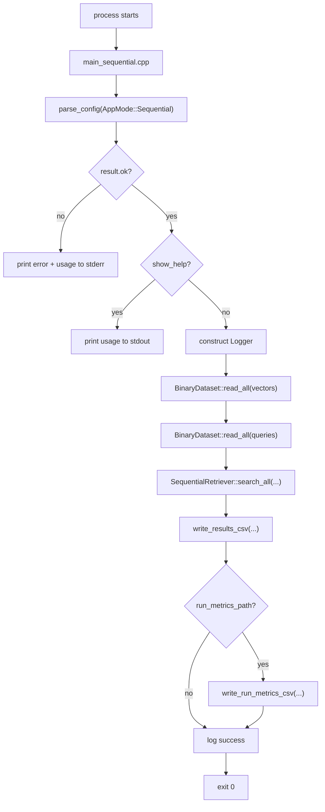
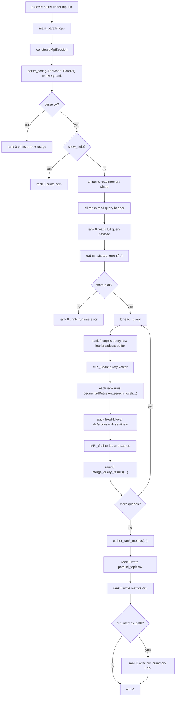
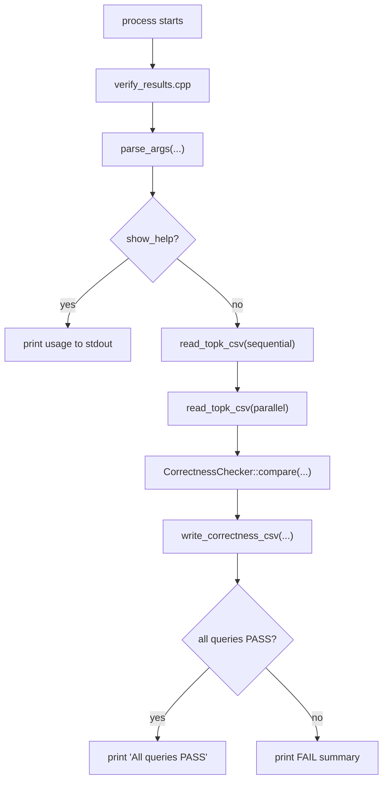

# Source Guide

This file merges the former `source_code_walkthrough.md` and `source_file_reference.md` without shortening their content.

## Included Documents

- `source_code_walkthrough.md`
- `source_file_reference.md`

---

# Source Code Walkthrough

## Purpose

This document explains how the current Phase 1, Phase 2, Phase 3, Phase 4, Phase 5, Phase 6, Phase 7, and Phase 8 code actually runs at source level.

It is written for two use cases:

- understanding the runtime pipeline for a report or presentation
- onboarding the next engineer before later corpus expansion and appendix/demo layers are added

The codebase currently provides:

- retriever CLI parsing and validation
- MPI process bootstrap for the parallel binary
- deterministic synthetic dataset generation
- binary dataset reading and shard-aware loading
- exact sequential top-k retrieval over normalized vectors
- exact blocking MPI top-k retrieval over sharded memory vectors
- canonical top-k CSV output for both retriever binaries
- per-rank metrics CSV output for the parallel binary
- sequential-vs-parallel correctness comparison over canonical top-k CSV files
- one-run benchmark summary metrics for both retriever binaries
- WSL-first benchmark automation scripts for runtime selection, correctness, granularity, and speedup studies
- dedicated physical-cluster bundle and postprocess wrappers for the validated two-node operator flow
- Python benchmark helpers for CSV aggregation and headless figure generation
- a Phase 8 FAISS exact-flat external baseline workflow over the same binary dataset contract
- a real-corpus conversion path for `SQuAD + sentence-transformers/all-MiniLM-L6-v2`
- smoke and validation tests

The major work still deferred is broader real-text corpus conversion beyond the SQuAD path, alternate baseline families beyond FAISS exact flat, metadata-backed demo layers, and report-oriented packaging around the working retrieval and baseline pipeline.

## Reading Order

If you want the fastest path to understanding, read the source in this order:

1. `CMakeLists.txt`
2. `src/main_sequential.cpp`
3. `src/main_parallel.cpp`
4. `include/SequentialRetriever.hpp`
5. `src/SequentialRetriever.cpp`
6. `include/ParallelRetriever.hpp`
7. `src/ParallelRetriever.cpp`
8. `include/MpiUtils.hpp`
9. `src/MpiUtils.cpp`
10. `include/TopKHeap.hpp`
11. `src/TopKHeap.cpp`
12. `include/BinaryDataset.hpp`
13. `src/BinaryDataset.cpp`
14. `src/MpiSession.cpp` and `include/MpiSession.hpp`
15. `src/Config.cpp` and `include/Config.hpp`
16. `src/Logger.cpp` and `include/Logger.hpp`
17. `tools/generate_vectors.cpp`
18. `tools/generate_queries.cpp`
19. `tools/SyntheticGeneratorCommon.hpp`
20. `tools/inspect_dataset.cpp`
21. `tools/verify_results.cpp`
22. `include/CorrectnessChecker.hpp`
23. `src/CorrectnessChecker.cpp`
24. `include/BenchmarkMetrics.hpp`
25. `src/BenchmarkMetrics.cpp`
26. `scripts/benchmark_common.sh`
27. `scripts/run_calibrate_target.sh`
28. `scripts/run_select_N.sh`
29. `scripts/run_correctness.sh`
30. `scripts/run_granularity.sh`
31. `scripts/run_speedup.sh`
32. `scripts/run_all_experiments.sh`
33. `scripts/run_faiss_comparison.sh`
34. `scripts/cluster_n_node_common.sh`
35. `scripts/run_cluster_n_node_bundle.sh`
36. `scripts/cluster_common.sh`
37. `scripts/run_cluster_two_node_bundle.sh`
38. `scripts/run_cluster_postprocess.sh`
39. `scripts/phase8_common.py`
40. `scripts/faiss_compare.py`
41. `scripts/prepare_squad_minilm.py`
42. `scripts/benchmark_csv.py`
43. `scripts/analyze_benchmarks.py`
44. `scripts/plot_results.py`
45. `tests/BenchmarkMetricsTest.cpp`
44. `tests/CorrectnessCheckerTest.cpp`
45. `tests/SequentialRetrieverTest.cpp`
46. `tests/ParallelRetrieverTest.cpp`
47. `tests/BinaryDatasetTest.cpp`
48. `tests/ConfigLoggerTest.cpp`
49. `tests/cmake/*.cmake`

For a file-by-file reference, also read [source_file_reference.md](#source-file-reference).

## Build Targets and Ownership

`CMakeLists.txt` defines the current executable layout:

- `retriever_core`
  - shared internal library
  - contains `BinaryDataset.cpp`, `BenchmarkMetrics.cpp`, `Config.cpp`, `CorrectnessChecker.cpp`, `Logger.cpp`, `TopKHeap.cpp`, `SequentialRetriever.cpp`, and `ParallelRetriever.cpp`
- `sequential_retriever`
  - exact sequential CLI entrypoint
  - links against `retriever_core`
- `parallel_retriever`
  - exact blocking MPI CLI entrypoint
  - links against `retriever_core`, `MpiUtils.cpp`, `MpiSession.cpp`, and `MPI::MPI_CXX`
- `verify_results`
  - correctness-check CLI entrypoint for comparing sequential and parallel top-k CSV outputs
  - links against `retriever_core`
- `generate_vectors`
  - synthetic memory-vector generator
- `generate_queries`
  - synthetic query-vector generator
- `inspect_dataset`
  - read-only binary header inspector
- `correctness_checker_test`
  - correctness comparison validation and failure-mode checks
- `benchmark_metrics_test`
  - run-summary metrics aggregation and speedup-row validation
- `config_logger_test`
  - parser and usage-contract checks
- `binary_dataset_test`
  - binary dataset validation and shard checks
- `sequential_retriever_test`
  - sequential retrieval correctness checks
- `parallel_retriever_test`
  - global merge and sentinel-handling checks

The design intent is:

- shared exact-search and merge logic lives in `retriever_core`
- shared correctness-comparison semantics also live in `retriever_core`
- shared benchmark-summary semantics also live in `retriever_core`
- MPI lifecycle and collective transport stay in the parallel executable layer
- generator-specific parsing and sampling stay in `tools/`
- file I/O and CSV writing remain CLI-entrypoint responsibilities
- benchmark orchestration and plotting live in WSL-first scripts rather than new C++ executables

## High-Level Architecture

```mermaid
flowchart TD
    A["sequential_retriever"] --> B["main_sequential.cpp"]
    C["parallel_retriever"] --> D["main_parallel.cpp"]
    E["generate_vectors / generate_queries"] --> F["tool mains"]
    G["inspect_dataset"] --> H["inspect_dataset.cpp"]
    AA["verify_results"] --> AB["verify_results.cpp"]

    B --> I["Config::parse_config"]
    B --> J["BinaryDataset::read_all"]
    B --> K["SequentialRetriever::search_all"]
    B --> L["write_results_csv / write_run_metrics_csv"]

    D --> M["MpiSession"]
    D --> I
    D --> N["BinaryDataset::read_shard"]
    D --> O["BinaryDataset::read_header / read_all"]
    D --> P["MpiUtils::broadcast_query_vector"]
    D --> Q["SequentialRetriever::search_local"]
    D --> R["MpiUtils::gather_fixed_candidates"]
    D --> S["ParallelRetriever::merge_query_results"]
    D --> T["MpiUtils::gather_rank_metrics"]
    D --> U["write_results_csv / write_metrics_csv / write_run_metrics_csv"]

    F --> V["SyntheticGeneratorCommon"]
    F --> W["BinaryDataset::make_header / write"]
    H --> X["BinaryDataset::read_header"]
    AB --> AC["read_topk_csv"]
    AB --> AD["CorrectnessChecker::compare"]
    AB --> AE["write_correctness_csv"]

    AF["run_* benchmark scripts"] --> AG["benchmark_common.sh"]
    AF --> AH["benchmark_csv.py"]
    AF --> AI["plot_results.py"]
    AG --> C
    AG --> E
    AG --> AA
    AJ["run_faiss_comparison.sh"] --> AG
    AJ --> AK["faiss_compare.py"]
    AJ --> AL["prepare_squad_minilm.py"]
    AK --> AM["phase8_common.py"]
    AL --> AM
    AJ --> AH

    I --> Y["Logger"]
    M --> Z["MPI_Init / MPI_Finalize"]
```

## Runtime Pipeline by Executable

## 1. `sequential_retriever`

### Control Flow

### What happens in detail

1. `main_sequential.cpp` calls `parse_config(AppMode::Sequential, argc, argv)`.
2. Parse failure prints `Error: ...` plus usage, then exits `1`.
3. `--help` prints usage and exits `0`.
4. Normal execution:
   - constructs `Logger`
   - loads memory/query payloads with `BinaryDataset::read_all(...)`
   - calls `SequentialRetriever::search_all(...)`
   - writes `query_id,rank_position,memory_id,score`
   - optionally writes one `RunMetricsRow` CSV when `--run-metrics` is present
5. Any runtime exception is caught at `main` boundary and printed as `Error: ...`.

## 2. `parallel_retriever`

### Control Flow

### What happens in detail

1. `main_parallel.cpp` constructs `MpiSession`, which initializes MPI if needed and exposes `rank()` and `size()`.
2. Every rank parses the same CLI contract:
   - `--vectors`
   - `--queries`
   - `--output`
   - `--topk`
   - `--metrics`
   - optional `--log-level`
   - optional `--help`
3. Parse failure is handled exactly once by rank `0`; all ranks return `1`.
4. `--help` is printed only by rank `0`; all ranks return `0`.
5. Normal execution is split into startup, query loop, and finalization.

### Startup phase

Every rank tries to:

1. load its local memory shard with `BinaryDataset::read_shard(...)`
2. read the query header with `BinaryDataset::read_header(...)`
3. let rank `0` read the full query payload with `BinaryDataset::read_all(...)`
4. validate:
   - normalized flag on both datasets
   - row-major flag on both datasets
   - dimension equality
   - `topk >= 1`
   - `topk <= global num_vectors`

If any rank fails during startup, it does not throw out of MPI control flow immediately. Instead it records the error and all ranks call `gather_startup_errors(...)` so rank `0` can print one final `Error: ...` line without deadlocking the job.

### Query loop

For each query row:

1. rank `0` copies the query row into a reusable `std::vector<float>` broadcast buffer
2. `MpiUtils::broadcast_query_vector(...)` runs `MPI_Bcast`
3. each rank calls `SequentialRetriever::search_local(...)` on:
   - its local shard payload
   - the broadcasted query vector
   - `memory_id_offset = shard_start_index`
4. `MpiUtils::pack_local_candidates_fixed_k(...)` converts the variable-length local result into exactly `k` slots:
   - valid candidates first
   - remaining slots padded with `memory_id = UINT64_MAX`
   - padded scores set to `-inf`
5. `MpiUtils::gather_fixed_candidates(...)` gathers `uint64_t[k]` and `float[k]` buffers from every rank
6. rank `0` reconstructs a flat candidate list and calls `ParallelRetriever::merge_query_results(...)`
7. rank `0` appends the merged `QueryTopKResult`

### Finalization phase

After the query loop:

1. each rank reports:
   - `local_N`
   - `compute_time`
   - `communication_time`
   - `local_total_time`
2. `MpiUtils::gather_rank_metrics(...)` gathers those values on rank `0`
3. rank `0` computes:
   - `active_time = compute_time + communication_time`
   - `global_total_time = max(local_total_time across ranks)`
   - `idle_time = global_total_time - active_time`
4. rank `0` writes:
   - `parallel_topk.csv`
   - `parallel_metrics.csv`
   - optional one-row run-summary metrics CSV when `--run-metrics` is present

### Why the local-search core is reused

The parallel binary does not duplicate dot-product or heap logic. It reuses `SequentialRetriever::search_local(...)` exactly as planned in Phase 3, which keeps:

- local ranking behavior identical to the sequential path
- tie-breaking logic shared
- future correctness comparison simpler

## 3. `ParallelRetriever`

`ParallelRetriever` is MPI-agnostic shared core code.

### Purpose

It takes the flat candidate list gathered from all ranks and merges it into one deterministic `QueryTopKResult`.

### What it does

- filters sentinel slots where `memory_id == UINT64_MAX`
- keeps only the best `k` candidates
- preserves the global ordering rule:
  - higher score first
  - lower `memory_id` first on ties

### Why it lives in `retriever_core`

This merge step is part of retrieval semantics, not MPI transport. By keeping it in the shared core:

- it stays testable without `mpirun`
- later correctness tools can reuse the same ordering logic

## 4. `MpiUtils`

`MpiUtils` is the transport and coordination helper layer for the parallel binary.

### What it provides

- `broadcast_query_vector(...)`
- `pack_local_candidates_fixed_k(...)`
- `gather_fixed_candidates(...)`
- `gather_rank_metrics(...)`
- `gather_startup_errors(...)`

### Why it is not part of `retriever_core`

`MpiUtils` depends directly on MPI collectives and exists only to support the executable runtime. The shared core should remain reusable for non-MPI correctness tests and future tooling.

### Fixed-size gather design

Phase 4 deliberately avoids custom MPI datatypes and `MPI_Gatherv`.

Instead:

1. every rank always sends exactly `k` ids and `k` scores
2. short local result lists are padded with sentinel values
3. rank `0` reconstructs and filters the combined candidate list

This keeps the blocking gather path simple and robust even when:

- `world_size > num_vectors`
- a rank receives `local_N = 0`
- a rank receives fewer than `k` local vectors

## 5. `TopKHeap`

`TopKHeap` is the shared deterministic candidate-retention structure used by both the sequential local scan and the parallel global merge.

### Ordering contract

- better candidate = higher score
- if scores tie, lower `memory_id` is better
- worse candidate = lower score
- if scores tie, higher `memory_id` is worse

Because the same heap and comparison helpers are reused in both phases, sequential and parallel output order stays aligned.

## 6. `BinaryDataset`

`BinaryDataset` remains the single source of truth for binary format and shard decomposition.

### Phase 4 reuse points

- `read_shard(...)` gives each rank:
  - validated header
  - local values buffer
  - `ShardBounds { start_index, count }`
- `read_all(...)` on rank `0` gives the full query payload
- `read_header(...)` on non-root ranks lets the MPI path size its query broadcast buffer without loading the full query file everywhere

The important design point is that Phase 4 did not re-decide sharding. It reused the Phase 2 dataset layer exactly.

## 7. `generate_vectors`

This binary is unchanged in behavior from Phase 2:

- parse `--N`, `--D`, `--output`, optional `--seed`
- generate deterministic normalized vectors
- write the binary dataset header + payload

## 8. `generate_queries`

This binary mirrors `generate_vectors` but uses `--Q`.

## 9. `inspect_dataset`

This binary remains the read-only metadata inspector for binary vector files.

## 10. `verify_results`

This binary is the Phase 5 correctness-checking entrypoint.

### Control Flow

### What it does

1. parses:
   - `--sequential`
   - `--parallel`
   - `--epsilon`
   - `--output`
   - optional `--help`
2. rejects malformed CSV input before any comparison result is written
3. validates and sorts rows through `CorrectnessChecker::compare(...)`
4. writes one row per query to `correctness.csv`
5. returns:
   - `0` when all queries pass
   - `1` when comparison completed but at least one query failed
   - `2` for CLI, CSV, or runtime errors

## 11. `BenchmarkMetrics`

`BenchmarkMetrics` is the shared Phase 6 summary layer.

### Purpose

It converts one invocation of either retriever into a canonical one-row benchmark record that later scripts can aggregate without re-deriving timing semantics.

### What it does

- defines `RunMetricsRow`
- defines `SpeedupRow`
- constructs the sequential baseline row with:
  - `P = 1`
  - `communication_time = 0`
- constructs the parallel summary row with:
  - `compute_time = max(rank.compute_time)`
  - `communication_time = max(rank.communication_time)`
  - `total_time = global_total_time`
- derives speedup and efficiency rows from one sequential baseline plus one parallel summary row
- writes the exact header:
  - `N,D,Q,k,P,compute_time,communication_time,total_time`

### Why it lives in `retriever_core`

These timing semantics are part of the benchmark contract now, not just shell-script glue. Keeping them in shared C++ code ensures:

- both retriever binaries write the same schema
- the sequential baseline uses the intended denominator for speedup
- later benchmark scripts do not need to guess which timing fields are comparable

## 12. Benchmark Automation Scripts

Phase 7 keeps experiment orchestration in WSL-first scripts instead of adding a second benchmark executable layer.

### What they do

- `run_calibrate_target.sh`
  - sweeps candidate `N` values
  - falls back to a `Q` sweep when `N` alone cannot reach the runtime target
  - chooses an explicit `N_SPEEDUP` from sequential baseline probes
  - writes `runtime_by_N.csv`
  - writes `benchmark_selection.env`
- `run_select_N.sh`
  - delegates to `run_calibrate_target.sh` for compatibility with earlier docs and scripts
- `run_correctness.sh`
  - runs sequential retrieval, parallel retrieval, and `verify_results`
  - writes the canonical correctness artifacts under `results/`
- `run_granularity.sh`
  - runs one canonical parallel job
  - promotes its per-rank metrics CSV to `granularity.csv`
  - writes a short idle-time summary
- `run_speedup.sh`
  - runs the sequential baseline plus multiple parallel `P` values
  - writes `speedup.csv`
- `run_all_experiments.sh`
  - runs the full synthetic benchmark pipeline
  - bootstraps plotting support
  - generates PNG figures

### Why the scripting layer matters

This project now has a complete synthetic benchmark loop:

1. calibrate `N`, and escalate `Q` only if needed
2. verify correctness
3. inspect load balance
4. measure speedup
5. generate figures for reporting

That workflow is now part of the maintained developer path, not an external ad hoc process.

## 13. Phase 8 External Baseline Scripts

Phase 8 adds a separate Python-and-shell baseline layer. It does not replace the Phase 3 and Phase 4 retrievers. Instead, it uses the exact same binary input contract and compares the project implementation against FAISS as an external reference.

### `phase8_common.py`

This file is the narrow shared helper layer for the Phase 8 Python scripts.

It owns:

- binary header parsing for the existing `PMRAGV1` contract
- validation that both datasets are normalized and row-major
- binary writing for converted real-corpus datasets
- canonical top-k CSV writing for FAISS outputs
- Phase 8 run-metrics CSV writing
- `metadata.tsv` writing for converted real corpora

The important design choice is that this file mirrors the repository binary contract rather than inventing a second vector-file format just for the FAISS workflow.

### `faiss_compare.py`

This script is the exact-flat baseline runner.

It:

1. reads `vectors.bin` and `queries.bin`
2. validates dimensions, flags, and `topk`
3. builds `faiss.IndexFlatIP`
4. runs exact top-k search
5. writes:
   - top-k CSV with the same schema as `sequential_retriever`
   - one-row FAISS run-metrics CSV with:
     - `dataset_name,N,D,Q,k,threads,build_time,compute_time,total_time`

The script keeps timing boundaries explicit:

- `build_time` measures `IndexFlatIP.add(...)`
- `compute_time` measures `IndexFlatIP.search(...)`
- `total_time` is currently locked equal to `compute_time`

This preserves the fairness policy chosen in the master plan: FAISS cold-start index construction is reported, but it is not mixed into the canonical end-to-end comparison denominator.

### `prepare_squad_minilm.py`

This script is the current real-corpus conversion entrypoint.

It:

1. reads SQuAD parquet files from `/mnt/e/data/squad/plain_text` by default
2. extracts unique train `context` strings as memory texts
3. extracts validation `question` strings as query texts
4. embeds both with `sentence-transformers/all-MiniLM-L6-v2`
5. normalizes the embeddings through `SentenceTransformer(..., normalize_embeddings=True)`
6. writes:
   - `vectors.bin`
   - `queries.bin`
   - `metadata.tsv`

This script creates a real-corpus dataset that the existing sequential and parallel retrievers can consume without any code changes.

### `run_faiss_comparison.sh`

This script is the orchestration layer for the Phase 8 baseline experiment.

It:

1. loads the benchmark environment through `benchmark_common.sh`
2. reuses a complete `benchmark_selection.env` or regenerates it if the file is missing or still uses the older schema
3. runs:
   - sequential retrieval
   - parallel retrieval
   - FAISS exact-flat retrieval
   - correctness verification between sequential and FAISS
4. repeats the same flow for:
   - one synthetic dataset
   - one real `SQuAD + MiniLM` dataset
5. calls `benchmark_csv.py build-faiss-comparison`
6. writes `results/faiss/comparison.csv`

This makes Phase 8 a maintained workflow rather than a one-off report script.

### `cluster_common.sh`

This script is the shared shell helper layer for the validated physical-cluster bundle flow.

It:

1. extends `benchmark_common.sh`
2. validates the sourced bundle config
3. detects the head-node physical-core count
4. derives:
   - `cluster_p_total`
   - `cluster_faiss_threads`
   - per-run result and scratch directories
5. rejects real execution from `/mnt/...` head-node checkouts
6. rewrites hostfiles for per-`P` speedup sweeps
7. centralizes:
   - worker sync helpers
   - WSL-specific OpenMPI flags
   - dry-run plan output

### `cluster_n_node_common.sh`

This script is the shared shell helper layer for the generic post-calibration N-node cluster rerun flow.

It:

1. extends `benchmark_common.sh`
2. validates the sourced generic bundle config
3. parses a hostfile with explicit `slots=...`
4. derives:
   - `cluster_node_count`
   - `cluster_p_total`
   - per-run result and scratch directories
5. rejects real execution from `/mnt/...` head-node checkouts
6. rewrites reduced hostfiles in host order for per-`P` speedup sweeps
7. reuses one max-N memory dataset for the cluster runtime-by-N sweep through `parallel_retriever --limit-n`
8. keeps oversubscribed speedup runs alive by falling back to the full hostfile when `P > cluster_p_total`
9. centralizes:
   - selected-workload path handling
   - speedup-workload path handling
   - WSL-safe OpenMPI flags
   - dry-run plan output

### `run_cluster_two_node_bundle.sh`

This script is the dedicated operator wrapper for the validated:

- `rag-head`
- `rag-worker1`

physical-cluster case.

It:

1. sources `cluster_common.sh`
2. loads a shell config file for the concrete two-node environment
3. runs the maintained six-stage cluster flow:
   - runtime calibration
   - selected synthetic correctness run
   - granularity summary
   - speedup sweep
   - FAISS comparisons
   - postprocess
4. writes the full artifact bundle under:
   - `results/cluster/<run-tag>/`
5. keeps the generic cluster guides manual by scoping automation to the validated two-node case only

### `run_cluster_n_node_bundle.sh`

This script is the generic operator wrapper for a prepared:

- `rag-head`
- `rag-worker*`

physical-cluster topology.

It:

1. sources `cluster_n_node_common.sh`
2. loads a shell config file for the prepared N-node environment
3. copies an existing `benchmark_selection.env` into the cluster result directory
4. runs the maintained five-stage cluster flow:
   - runtime-by-N sweep
   - selected synthetic correctness run
   - granularity summary
   - speedup sweep
   - postprocess
5. writes the full artifact bundle under:
   - `results/cluster/<run-tag>/`
6. intentionally excludes dataset generation, file synchronization, SSH orchestration, and FAISS so the generic cluster guides keep those steps explicit

### `run_cluster_postprocess.sh`

This script is the postprocess-only cluster wrapper.

It:

1. requires an existing cluster result directory with the canonical raw CSV set
2. reuses:
   - `plot_results.py`
   - `analyze_benchmarks.py`
3. regenerates:
   - `results/cluster/<run-tag>/figures/`
   - `results/cluster/<run-tag>/analysis/`
   - `docs/analysis/latest-cluster-benchmark-review.md`

## How Data Moves Through the Current Pipeline

The working pipeline is now:

1. `generate_vectors`
2. `generate_queries`
3. `inspect_dataset` when needed
4. `sequential_retriever`
5. `parallel_retriever`
6. `verify_results`
7. optional `--run-metrics` outputs from retrievers
8. benchmark automation scripts and figure generation
9. optional `prepare_squad_minilm.py` conversion for the Phase 8 real-corpus path
10. `run_faiss_comparison.sh` for synthetic-plus-real FAISS baseline comparison
11. optional `run_cluster_n_node_bundle.sh` for the generic prepared-cluster post-calibration rerun
12. optional `run_cluster_two_node_bundle.sh` for the validated physical-cluster full bundle
13. optional `run_cluster_postprocess.sh` for cluster-only figure and analysis regeneration
14. `analyze_benchmarks.py` for derived analysis CSVs, JSON summaries, and report-ready Markdown conclusions

In more detail:

1. synthetic tools generate normalized row-major `float32` binaries
2. sequential mode loads full memory + query payloads and writes:
   - `sequential_topk.csv`
   - optional sequential run-summary CSV
3. parallel mode loads memory shards, broadcasts queries, gathers local top-k, merges them, and writes:
   - `parallel_topk.csv`
   - `parallel_metrics.csv`
   - optional parallel run-summary CSV
4. correctness mode reads `sequential_topk.csv` and `parallel_topk.csv`, compares aligned rank rows, and writes:
   - `correctness.csv`
5. benchmark scripts aggregate those outputs into:
   - `runtime_by_N.csv`
   - `granularity.csv`
   - `speedup.csv`
   - `benchmark_selection.env`
   - `results/figures/*.png`
6. the Phase 8 real-corpus prep script optionally converts SQuAD text into:
   - `vectors.bin`
   - `queries.bin`
   - `metadata.tsv`
7. the Phase 8 FAISS workflow reuses both synthetic and real binary datasets to produce:
   - `results/faiss/*_topk.csv`
   - `results/faiss/*_run_metrics.csv`
   - `results/faiss/*_correctness.csv`
   - `results/faiss/comparison.csv`
8. the generic prepared-cluster bundle can rerun the selected synthetic workload, speedup sweep, and postprocess against a physical cluster, then writes:
   - `results/cluster/<run-tag>/*.csv`
   - `results/cluster/<run-tag>/analysis/*`
   - `results/cluster/<run-tag>/figures/*`
   - `docs/analysis/latest-cluster-benchmark-review.md`
9. the dedicated validated two-node bundle can run the same synthetic and FAISS flows against a physical cluster, then writes:
   - `results/cluster/<run-tag>/*.csv`
   - `results/cluster/<run-tag>/faiss/*.csv`
   - `results/cluster/<run-tag>/analysis/*`
   - `results/cluster/<run-tag>/figures/*`
   - `docs/analysis/latest-cluster-benchmark-review.md`
10. the analysis layer reads the final runtime, correctness, granularity, speedup, and FAISS outputs, then writes:
   - `results/analysis/*.csv`
   - `results/analysis/benchmark_summary.json`
   - `results/analysis/final_conclusions.md`
   - `docs/analysis/latest-benchmark-review.md`

At the end of Phase 8, the project has an end-to-end synthetic benchmark path plus an external-baseline comparison path over both synthetic vectors and one converted real corpus.

## Tests as Executable Documentation

## `ConfigLoggerTest.cpp`

This test file documents the retriever CLI contract by checking:

- help parsing
- missing required options
- invalid `--topk`
- invalid `--log-level`
- parallel-only `--metrics`
- usage text contents for both binaries

## `BinaryDatasetTest.cpp`

This test file documents the binary contract by checking:

- valid header round-trip
- invalid magic rejection
- invalid version rejection
- zero-dimension rejection
- truncated payload rejection
- divisible shard math
- non-divisible shard math
- correctness of `read_shard`

## `SequentialRetrieverTest.cpp`

This test file documents the Phase 3 local-search contract by checking:

- heap keeps only the best `k`
- tie-break prefers lower `memory_id`
- exact single-query top-k on a known matrix
- exact multi-query results
- `memory_id_offset` behavior
- dimension mismatch failure
- `topk > num_vectors` failure

## `ParallelRetrieverTest.cpp`

This test file documents the Phase 4 global-merge contract by checking:

- merge keeps only the best global `k`
- tie-break on `memory_id`
- sentinel candidates are ignored
- merge still works when some ranks contribute no valid local results

## `CorrectnessCheckerTest.cpp`

This test file documents the Phase 5 correctness contract by checking:

- exact-match pass behavior
- `memory_id` mismatch failure
- score-difference tolerance handling
- multi-query sorting and grouping
- duplicate rank rejection
- non-contiguous rank rejection
- query-set mismatch rejection

## `BenchmarkMetricsTest.cpp`

This test file documents the Phase 6 summary contract by checking:

- sequential run rows use `P = 1` and `communication_time = 0`
- parallel summaries use the maximum compute and communication times across ranks
- parallel summaries preserve `global_total_time`
- `SpeedupRow` math is correct for baseline and parallel rows
- mismatched `N`, `D`, `Q`, or `k` is rejected
- invalid baseline `P` and non-positive times are rejected

## CMake-driven smoke tests

The `tests/cmake/*.cmake` scripts validate executable-level behavior:

- tool `--help` works
- generator output can be inspected successfully
- deterministic seeds produce byte-identical files
- different seeds change the binary output
- `sequential_retriever` writes the expected CSV on small input
- sequential dimension mismatch fails cleanly
- `parallel_retriever` matches sequential CSV output on small input
- `parallel_retriever` writes the metrics CSV with the expected line count
- `parallel_retriever` still succeeds when `world_size > N`
- parallel dimension mismatch fails cleanly under `mpirun`
- `verify_results` writes the expected correctness CSV on matching input
- `verify_results` returns `1` and still writes output on logical mismatch
- `verify_results` returns `2` on malformed CSV input
- sequential `--run-metrics` writes the exact one-row summary schema
- parallel `--run-metrics` writes the exact one-row summary schema
- `run_calibrate_target.sh` writes `runtime_by_N.csv`, a complete `benchmark_selection.env`, and the correct calibration-mode semantics
- `run_select_N.sh` still works as a compatibility wrapper
- `run_correctness.sh` writes the expected correctness artifacts
- `run_granularity.sh` writes `granularity.csv` and a summary note
- `run_speedup.sh` writes `speedup.csv` with a sequential `P = 1` baseline row
- `run_all_experiments.sh` writes the final CSV set and all benchmark figures
- `benchmark_csv.py build-faiss-comparison` writes the final Phase 8 comparison table
- `run_faiss_comparison.sh` writes the expected FAISS synthetic and real-corpus artifacts on a reduced smoke profile
- `analyze_benchmarks.py` writes derived analysis outputs, invalid-correctness gating, and the final report-ready Markdown review
- `run_cluster_postprocess.sh` writes the expected cluster figures, derived analysis outputs, and cluster review doc on fixture input
- `run_cluster_n_node_bundle.sh --dry-run` prints the expected five-stage plan, parsed node count, runtime-by-N list, speedup list, and cluster result paths
- `run_cluster_two_node_bundle.sh --dry-run` prints the expected six-stage plan and cluster result paths

## Source Boundaries to Remember After Phase 8

- `parse_config` is only for retriever binaries
- `BinaryDataset` owns file format and shard decomposition
- `SequentialRetriever::search_local(...)` is the shared exact local-search kernel
- `ParallelRetriever` owns global top-k merge semantics
- `CorrectnessChecker` owns per-query top-k CSV comparison semantics
- `BenchmarkMetrics` owns canonical run-summary and speedup-row semantics
- `MpiUtils` owns blocking transport helpers and startup coordination
- `phase8_common.py` owns the Phase 8 Python-side mirror of the binary and CSV contracts
- `analyze_benchmarks.py` owns the post-run interpretation layer and must not rewrite raw benchmark CSV inputs
- rank `0` is the only process that prints human-facing CLI text and writes CSV files in the MPI path
- benchmark orchestration lives in scripts, but timing semantics stay in shared C++ code
- FAISS remains an external baseline workflow and does not move into `retriever_core`

## Suggested Report Framing

If you need to explain the current source code in a report, this wording fits the implementation well:

1. Phase 1 established the execution scaffold:
   - stable CLI contracts
   - logging
   - MPI bootstrap
2. Phase 2 established the dataset substrate:
   - deterministic synthetic data generation
   - fixed binary file contract
   - shard-aware loading
3. Phase 3 turned the sequential path into a real retriever:
   - exact dot-product search
   - deterministic top-k ranking
   - canonical CSV output
4. Phase 4 turned the MPI path into a real retriever:
   - shard-local exact search reuse
   - blocking broadcast and gather
   - deterministic global merge
   - per-rank metrics output
5. Phase 5 added correctness tooling around the working retrievers:
   - canonical sequential-vs-parallel CSV comparison
   - explicit epsilon-based score tolerance
   - per-query correctness reporting
6. Phase 6 locked benchmark-summary metrics inside the codebase:
   - canonical one-run summary rows
   - stable timing boundaries for fair speedup comparisons
   - shared speedup and efficiency calculations
7. Phase 7 turned the synthetic benchmark workflow into a reproducible automation pipeline:
   - runtime-by-`N` selection
   - correctness gating
   - granularity and load-balance reporting
   - speedup tables and headless figures
8. Phase 8 added an external baseline without replacing the custom implementation:
   - FAISS exact-flat comparison on the same normalized binary vectors
   - a real-corpus conversion path through `SQuAD + all-MiniLM-L6-v2`
   - comparison tables that keep correctness and fairness policies explicit
9. The benchmark-analysis layer now turns the final CSV artifacts into reusable conclusions:
   - derived classifications for runtime, load balance, speedup, and FAISS gap
   - machine-readable benchmark summaries
   - report-ready Markdown conclusions

---

# Source File Reference

## Purpose

This document explains the role of every current source and test file that matters to the Phase 1 through Phase 8 implementation.

Use [source_code_walkthrough.md](#source-code-walkthrough) for end-to-end flow.
Use this file when you want to answer: "What exactly is this file responsible for?"

## Shared Headers in `include/`

## `include/Config.hpp`

**Responsibility**

- declares the retriever CLI contract
- defines the parse result returned by `parse_config`

## `include/Logger.hpp`

**Responsibility**

- declares log levels
- exposes a minimal stderr logger

## `include/MpiSession.hpp`

**Responsibility**

- declares the RAII wrapper for MPI lifecycle management

## `include/BinaryDataset.hpp`

**Responsibility**

- declares the binary dataset contract and loader/writer API

## `include/TopKHeap.hpp`

**Responsibility**

- declares deterministic candidate ordering helpers and the fixed-size heap wrapper

## `include/SequentialRetriever.hpp`

**Responsibility**

- declares the reusable exact local-search and full sequential-search API

## `include/ParallelRetriever.hpp`

**Responsibility**

- declares the Phase 4 global merge API and the per-rank metrics row type

## `include/CorrectnessChecker.hpp`

**Responsibility**

- declares the Phase 5 top-k CSV row model and shared correctness-comparison API

## `include/BenchmarkMetrics.hpp`

**Responsibility**

- declares the Phase 6 run-summary metrics rows, speedup rows, and shared writer API

## `include/MpiUtils.hpp`

**Responsibility**

- declares the blocking MPI helper functions used only by the parallel binary

## Shared Implementations in `src/`

## `src/Config.cpp`

**Responsibility**

- implements retriever CLI parsing and help text

## `src/Logger.cpp`

**Responsibility**

- implements log-level parsing and stderr logging

## `src/MpiSession.cpp`

**Responsibility**

- implements safe MPI startup and teardown

## `src/BinaryDataset.cpp`

**Responsibility**

- implements validated binary dataset IO and shard computation

## `src/TopKHeap.cpp`

**Responsibility**

- implements the deterministic best-k heap

## `src/SequentialRetriever.cpp`

**Responsibility**

- implements exact in-memory dot-product retrieval for one query or all queries

## `src/ParallelRetriever.cpp`

**Responsibility**

- implements Phase 4 global merge over the gathered local candidates

## `src/CorrectnessChecker.cpp`

**Responsibility**

- implements CSV-row normalization, per-query validation, and sequential-vs-parallel comparison

## `src/BenchmarkMetrics.cpp`

**Responsibility**

- implements sequential and parallel run-summary construction, speedup-row construction, and summary CSV writing

## `src/MpiUtils.cpp`

**Responsibility**

- implements MPI broadcast, gather, metrics collection, and startup-error coordination helpers

## `src/main_sequential.cpp`

**Responsibility**

- orchestrates sequential file IO, exact search, and CSV output

## `src/main_parallel.cpp`

**Responsibility**

- orchestrates shard loading, query broadcast, local search, candidate gather, global merge, and metrics output

## Tool-Specific Files in `tools/`

## `tools/SyntheticGeneratorCommon.hpp`

**Responsibility**

- hosts shared helper code for synthetic dataset tools only

## `tools/generate_vectors.cpp`

**Responsibility**

- executable entrypoint for memory-vector generation

## `tools/generate_queries.cpp`

**Responsibility**

- executable entrypoint for query-vector generation

## `tools/inspect_dataset.cpp`

**Responsibility**

- executable entrypoint for read-only dataset inspection

## `tools/verify_results.cpp`

**Responsibility**

- executable entrypoint for correctness comparison and `correctness.csv` output

## Script Files in `scripts/`

## `scripts/benchmark_common.sh`

**Responsibility**

- defines the shared shell environment, dataset-cache paths, `mpirun` wrapper, and helper functions reused by benchmark and Phase 8 scripts

## `scripts/run_calibrate_target.sh`

**Responsibility**

- runs the maintained stage-1 benchmark calibration flow:
  - `N` sweep at base `Q`
  - fallback `Q` sweep when needed
  - explicit `N_SPEEDUP` selection from sequential probes
- writes `runtime_by_N.csv` and a complete `benchmark_selection.env`

## `scripts/run_select_N.sh`

**Responsibility**

- compatibility wrapper that delegates to `run_calibrate_target.sh`

## `scripts/run_correctness.sh`

**Responsibility**

- runs the canonical sequential-versus-parallel correctness workflow for the selected synthetic dataset

## `scripts/run_granularity.sh`

**Responsibility**

- runs one canonical parallel benchmark and promotes its per-rank metrics into `granularity.csv`

## `scripts/run_speedup.sh`

**Responsibility**

- runs the sequential baseline plus multiple parallel worker counts and writes `speedup.csv`

## `scripts/run_all_experiments.sh`

**Responsibility**

- orchestrates the full synthetic benchmark pipeline and figure-generation flow

## `scripts/benchmark_csv.py`

**Responsibility**

- implements focused CSV aggregation commands for calibration selection, manifest writing, speedup construction, granularity summaries, and the Phase 8 FAISS comparison table

## `scripts/analyze_benchmarks.py`

**Responsibility**

- reads the final benchmark CSV set and generates derived analysis tables, JSON summaries, and report-ready Markdown conclusions

## `scripts/plot_results.py`

**Responsibility**

- renders the benchmark PNG figures from the canonical CSV outputs

## `scripts/phase8_common.py`

**Responsibility**

- mirrors the repository binary-dataset and top-k CSV contracts on the Python side for Phase 8 helpers

## `scripts/faiss_compare.py`

**Responsibility**

- runs FAISS exact-flat search over existing binary datasets and writes canonical Phase 8 top-k plus run-metrics outputs

## `scripts/prepare_squad_minilm.py`

**Responsibility**

- converts local SQuAD parquet inputs into normalized binary memory/query vectors and a matching `metadata.tsv`

## `scripts/run_faiss_comparison.sh`

**Responsibility**

- orchestrates sequential, parallel, and FAISS comparison runs over both synthetic data and the current SQuAD + MiniLM real-corpus path

## `scripts/cluster_common.sh`

**Responsibility**

- hosts shared shell helpers for the validated two-node cluster bundle and cluster postprocess flow

## `scripts/cluster_n_node_common.sh`

**Responsibility**

- hosts shared shell helpers for the generic post-calibration N-node cluster bundle

## `scripts/run_cluster_two_node_bundle.sh`

**Responsibility**

- orchestrates the dedicated six-stage validated two-node cluster rerun flow

## `scripts/run_cluster_n_node_bundle.sh`

**Responsibility**

- orchestrates the generic five-stage post-calibration N-node cluster rerun flow

## `scripts/run_cluster_postprocess.sh`

**Responsibility**

- regenerates cluster-scoped figures, derived analysis outputs, and the cluster review Markdown doc from an existing cluster result directory

## Test Files in `tests/`

## `tests/ConfigLoggerTest.cpp`

**Responsibility**

- verifies CLI parsing and help text rules

## `tests/BinaryDatasetTest.cpp`

**Responsibility**

- verifies the binary dataset layer directly

## `tests/SequentialRetrieverTest.cpp`

**Responsibility**

- verifies exact local-search behavior directly

## `tests/ParallelRetrieverTest.cpp`

**Responsibility**

- verifies deterministic global merge behavior directly

## `tests/CorrectnessCheckerTest.cpp`

**Responsibility**

- verifies correctness comparison behavior directly

## `tests/BenchmarkMetricsTest.cpp`

**Responsibility**

- verifies run-summary aggregation and speedup-row behavior directly

## `tests/cmake/GenerateAndInspectDataset.cmake`

**Responsibility**

- smoke-checks generator and inspector behavior

## `tests/cmake/CheckGeneratorDeterminism.cmake`

**Responsibility**

- verifies identical bytes for identical seeds and different bytes for different seeds

## `tests/cmake/RunSequentialRetrievalSmoke.cmake`

**Responsibility**

- validates a real sequential retrieval run end-to-end

## `tests/cmake/RunSequentialDimensionMismatchFail.cmake`

**Responsibility**

- validates sequential dimension-mismatch failure behavior

## `tests/cmake/RunParallelRetrievalSmoke.cmake`

**Responsibility**

- validates a real MPI retrieval run end-to-end and compares its top-k CSV to the sequential result

## `tests/cmake/RunParallelWorldSizeGtNSmoke.cmake`

**Responsibility**

- proves the MPI path still succeeds when there are more ranks than memory rows

## `tests/cmake/RunParallelDimensionMismatchFail.cmake`

**Responsibility**

- validates MPI dimension-mismatch failure behavior

## `tests/cmake/RunVerifyResultsSmoke.cmake`

**Responsibility**

- validates a full sequential -> parallel -> correctness workflow on small input

## `tests/cmake/RunVerifyResultsMismatchSmoke.cmake`

**Responsibility**

- validates mismatch detection and exit-code `1` behavior

## `tests/cmake/RunVerifyResultsMalformedFail.cmake`

**Responsibility**

- validates malformed-input rejection and exit-code `2` behavior

## `tests/cmake/RunSequentialRunMetricsSmoke.cmake`

**Responsibility**

- validates the sequential `--run-metrics` output contract end-to-end

## `tests/cmake/RunParallelRunMetricsSmoke.cmake`

**Responsibility**

- validates the parallel `--run-metrics` and per-rank metrics output contracts end-to-end

## `tests/cmake/RunBenchmarkSelectNSmoke.cmake`

**Responsibility**

- validates the runtime-by-`N` selection stage and manifest generation

## `tests/cmake/RunBenchmarkCorrectnessSmoke.cmake`

**Responsibility**

- validates the benchmark correctness stage around sequential, parallel, and verify tooling

## `tests/cmake/RunBenchmarkGranularitySmoke.cmake`

**Responsibility**

- validates the benchmark granularity stage and summary-note generation

## `tests/cmake/RunBenchmarkSpeedupSmoke.cmake`

**Responsibility**

- validates the speedup stage and sequential-baseline row generation

## `tests/cmake/RunBenchmarkAllExperimentsSmoke.cmake`

**Responsibility**

- validates the reduced-profile end-to-end benchmark automation and figure generation flow

## `tests/cmake/RunFaissComparisonTableSmoke.cmake`

**Responsibility**

- validates the Phase 8 comparison-table builder against tiny fixture CSV inputs

## `tests/cmake/RunFaissComparisonWorkflowSmoke.cmake`

**Responsibility**

- validates the reduced-profile Phase 8 orchestration flow with synthetic data plus a prebuilt tiny real-corpus fixture

## `tests/cmake/RunBenchmarkAnalysisSmoke.cmake`

**Responsibility**

- validates end-to-end generation of derived analysis outputs from a complete benchmark fixture set

## `tests/cmake/RunBenchmarkAnalysisInvalidCorrectnessSmoke.cmake`

**Responsibility**

- validates that invalid correctness forces the analysis layer to mark performance conclusions as invalid

## `tests/cmake/RunBenchmarkAnalysisMissingInputFail.cmake`

**Responsibility**

- validates that the analysis layer fails clearly when a required benchmark input CSV is missing

## `tests/cmake/RunClusterPostprocessSmoke.cmake`

**Responsibility**

- validates end-to-end generation of cluster figures, derived analysis outputs, and the cluster docs-output review from a fixture cluster result directory

## `tests/cmake/RunClusterBundleDryRunSmoke.cmake`

**Responsibility**

- validates the dedicated two-node cluster bundle dry-run plan and result-path reporting

## `tests/cmake/RunClusterNNodeBundleDryRunSmoke.cmake`

**Responsibility**

- validates the generic N-node cluster bundle dry-run plan, parsed node count, and result-path reporting

## Build File

## `CMakeLists.txt`

**Responsibility**

- defines the current build and test graph

## Quick Mapping by Concern

- retriever CLI parsing:
  - `include/Config.hpp`
  - `src/Config.cpp`
- logging:
  - `include/Logger.hpp`
  - `src/Logger.cpp`
- sequential exact retrieval core:
  - `include/TopKHeap.hpp`
  - `src/TopKHeap.cpp`
  - `include/SequentialRetriever.hpp`
  - `src/SequentialRetriever.cpp`
- parallel global merge core:
  - `include/ParallelRetriever.hpp`
  - `src/ParallelRetriever.cpp`
- correctness comparison core:
  - `include/CorrectnessChecker.hpp`
  - `src/CorrectnessChecker.cpp`
- benchmark summary core:
  - `include/BenchmarkMetrics.hpp`
  - `src/BenchmarkMetrics.cpp`
- MPI helper layer:
  - `include/MpiUtils.hpp`
  - `src/MpiUtils.cpp`
- sequential CLI orchestration:
  - `src/main_sequential.cpp`
- parallel CLI orchestration:
  - `include/MpiSession.hpp`
  - `src/MpiSession.cpp`
  - `src/main_parallel.cpp`
- dataset format and IO:
  - `include/BinaryDataset.hpp`
  - `src/BinaryDataset.cpp`
- synthetic dataset generation:
  - `tools/SyntheticGeneratorCommon.hpp`
  - `tools/generate_vectors.cpp`
  - `tools/generate_queries.cpp`
- dataset inspection:
  - `tools/inspect_dataset.cpp`
- correctness comparison tool:
  - `tools/verify_results.cpp`
- benchmark automation:
  - `scripts/benchmark_common.sh`
  - `scripts/run_calibrate_target.sh`
  - `scripts/run_select_N.sh`
  - `scripts/run_correctness.sh`
  - `scripts/run_granularity.sh`
  - `scripts/run_speedup.sh`
  - `scripts/run_all_experiments.sh`
  - `scripts/benchmark_csv.py`
  - `scripts/analyze_benchmarks.py`
  - `scripts/plot_results.py`
- Phase 8 external baseline workflow:
  - `scripts/run_faiss_comparison.sh`
  - `scripts/phase8_common.py`
  - `scripts/faiss_compare.py`
  - `scripts/prepare_squad_minilm.py`
- generic post-calibration physical-cluster automation:
  - `scripts/cluster_n_node_common.sh`
  - `scripts/run_cluster_n_node_bundle.sh`
- validated two-node physical-cluster automation:
  - `scripts/cluster_common.sh`
  - `scripts/run_cluster_two_node_bundle.sh`
  - `scripts/run_cluster_postprocess.sh`
- executable behavior checks:
  - `tests/ConfigLoggerTest.cpp`
  - `tests/BinaryDatasetTest.cpp`
  - `tests/BenchmarkMetricsTest.cpp`
  - `tests/SequentialRetrieverTest.cpp`
  - `tests/ParallelRetrieverTest.cpp`
  - `tests/CorrectnessCheckerTest.cpp`
  - `tests/cmake/*.cmake`

## Suggested Maintenance Rule

Now that Phase 8 is in place, update this document whenever one of these happens:

- a new executable is added
- a header gains a new public type or function
- a file changes responsibility
- the runtime pipeline changes
- the benchmark automation or figure-generation workflow changes
