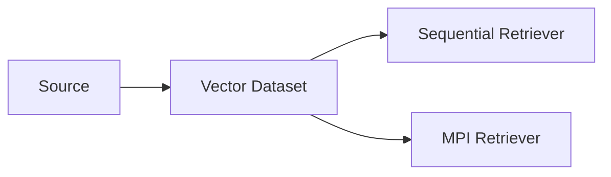

# Phase 0 Documentation Implementation Plan

> **For agentic workers:** REQUIRED SUB-SKILL: Use superpowers:subagent-driven-development (recommended) or superpowers:executing-plans to implement this plan task-by-task. Steps use checkbox (`- [ ]`) syntax for tracking.

**Goal:** Produce the Phase 0 specification documents that lock project scope, algorithm design, benchmark choices, and the WSL2 plus OpenMPI environment.

**Architecture:** Treat the documentation set as a small spec bundle. `docs/development/project_scope.md` defines the boundary and fixed choices, `docs/development/algorithm_design.md` defines the retrieval design and file contracts, and the supporting documents cover benchmark policy and environment setup.

**Tech Stack:** Markdown, Mermaid, existing project plan, Windows host datasets, WSL2, OpenMPI

---

### Task 1: Write the scope document

**Files:**
- Create: `docs/development/project_scope.md`

- [ ] **Step 1: Draft the fixed-decision table**

```md
| Topic | Decision | Rationale |
| --- | --- | --- |
| Primary platform | WSL2 Linux | Cleaner MPI workflow |
| Default dimension | D = 384 | Better memory-to-scale tradeoff |
```

- [ ] **Step 2: Add the pipeline and scope boundaries**

````md
## Pipeline

````

- [ ] **Step 3: Verify the document includes Phase 0 exit criteria**

Run: `rg -n "Phase 0 Exit Criteria|Parallel Computing Requirement Mapping" docs/development/project_scope.md`

Expected: Both sections are present.

### Task 2: Write the algorithm design document

**Files:**
- Create: `docs/development/algorithm_design.md`

- [ ] **Step 1: Document the binary dataset contract**

```md
magic[8]      = "PMRAGV1"
version       = uint32 = 1
flags         = uint32
num_vectors   = uint64
dimension     = uint32
```

- [ ] **Step 2: Document sequential and parallel algorithms**

```text
for each query q:
    compute local or global top-k
```

- [ ] **Step 3: Verify the document includes shard formulas and CSV schemas**

Run: `rg -n "local_N|start\\(rank\\)|Speedup|Correctness Output" docs/development/algorithm_design.md`

Expected: The shard and metrics sections are present.

### Task 3: Write the benchmark and environment docs

**Files:**
- Create: `docs/development/benchmark_data.md`
- Create: `docs/development/environment_setup.md`

- [ ] **Step 1: Record the chosen datasets and their roles**

```md
| Dataset | Use now | Role |
| --- | --- | --- |
| Synthetic generator | Yes | Main benchmark |
| MS MARCO v1.1 | Yes, later in core workflow | Large workload |
```

- [ ] **Step 2: Record the WSL2 plus OpenMPI setup**

```bash
sudo apt install -y openmpi-bin libopenmpi-dev cmake ninja-build
```

- [ ] **Step 3: Verify dataset mount and toolchain sections exist**

Run: `rg -n "/mnt/e/data|mpicxx --version|Synthetic Normalized Vectors" docs/development/benchmark_data.md docs/development/environment_setup.md`

Expected: The WSL mount, MPI verification, and synthetic benchmark policy are present.

### Task 4: Self-review for consistency

**Files:**
- Review: `docs/development/project_scope.md`
- Review: `docs/development/algorithm_design.md`
- Review: `docs/development/benchmark_data.md`
- Review: `docs/development/environment_setup.md`

- [ ] **Step 1: Confirm all fixed decisions agree across files**

Run: `rg -n "D = 384|OpenMPI|WSL2|k = 10" docs/development/project_scope.md docs/development/algorithm_design.md docs/development/benchmark_data.md docs/development/environment_setup.md`

Expected: The same defaults and environment appear consistently.

- [ ] **Step 2: Confirm the documents point back to the original project plan**

Run: `rg -n "parallel_agent_memory_retriever_plan.md" docs/development/project_scope.md`

Expected: The reference exists.

- [ ] **Step 3: Stop after documentation delivery**

No code, build scripts, or runtime binaries are added in this phase.
